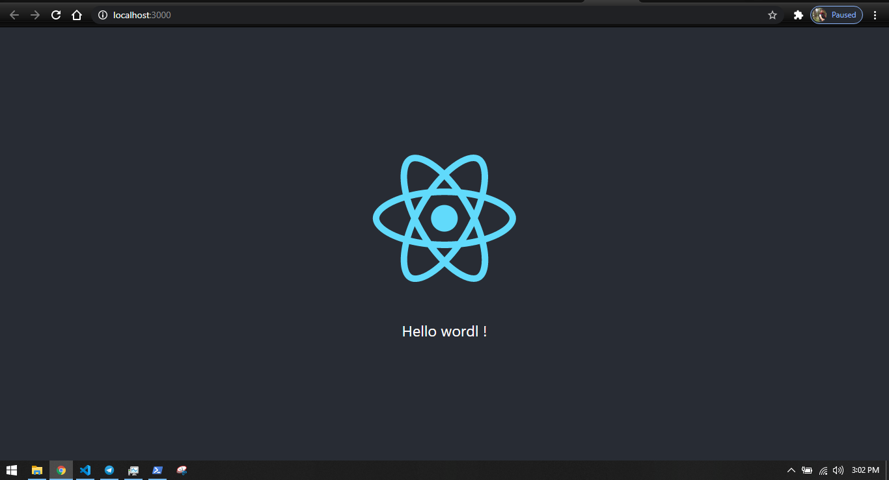
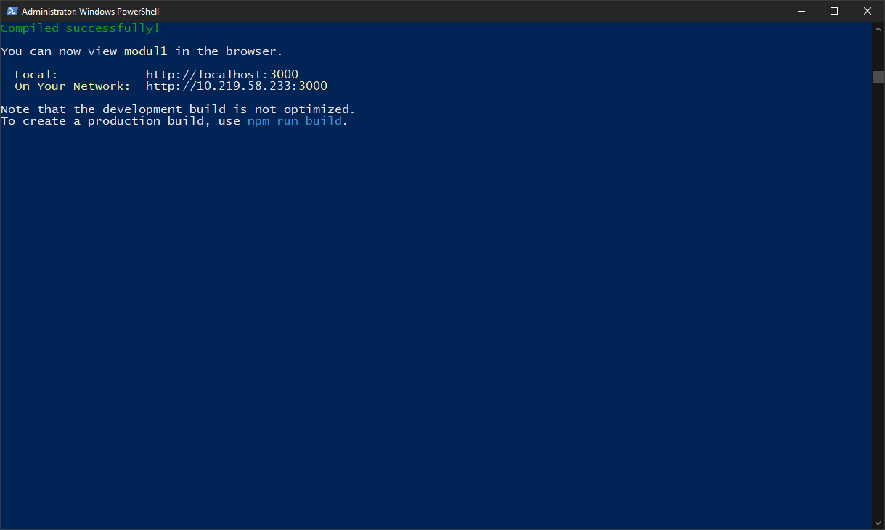
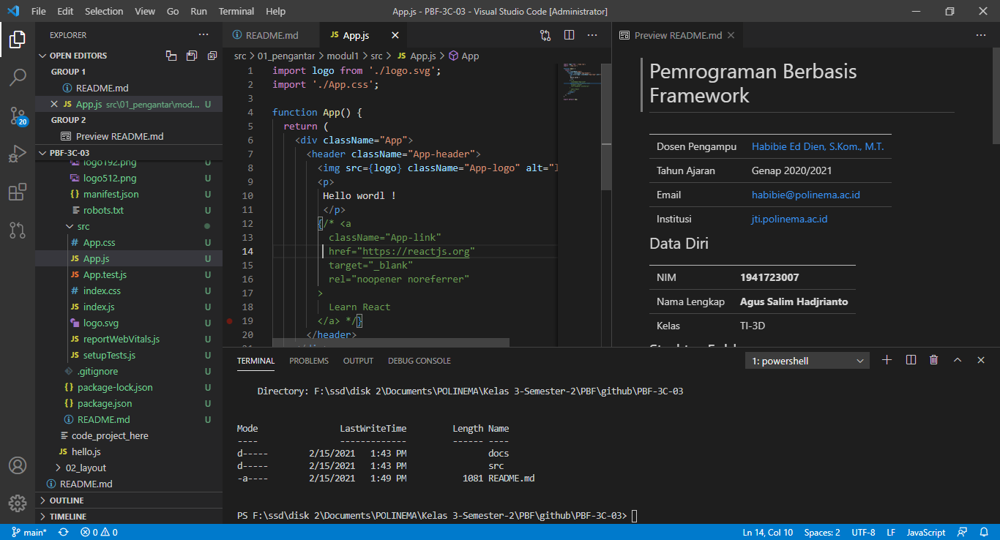

# 01 - Pengantar

## Tujuan Pembelajaran

1. Mahasiswa paham dengan konsep modern javascript 
2. Mahasiswa dapat membuat variabel dan parameter lainnya 

## Hasil Praktikum

### instalasi react dan menjalankanya

[contoh link](../../src/01_pengantar/hello.js)