# 02 - Layout

## Tujuan Pembelajaran

1. (bisa copy dari RPS kolom sub-CP-MK)
2. dst

## Hasil Praktikum
### Praktikum 1 : Embedding Expression di JSX

Masukan Code Berikut Lalu run npm start

    const nimNama = 'NIM - Nama';
    const element = <h1>Hello, {nimNama}</h1>;

    ReactDOM.render(
    element,
    document.getElementById('root')
    );

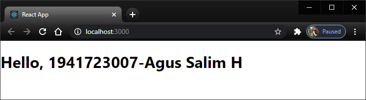

 

Kemudian Coba

    function formatNama (user) {
    return user.nim + ' - ' + user.nama;
    }

    const user = {
    nim: '1941723007',
    nama: 'Agus SaliM H'
    };

    const element = (
    <h1>
        Halo, {formatNama(user)}!
    </h1>
    );

    ReactDOM.render(
    element,
    document.getElementById('root')
    );

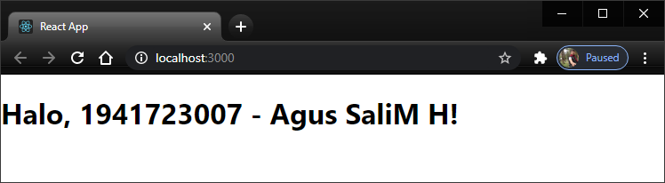

 

Menambah Element pada index.js

    const element = <h1>Hello, world</h1>;

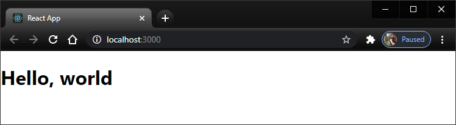

 

Rendering Element ke dalam DOM

    

    const element = <h1>"Hello, world"</h1>;
    ReactDOM.render(element, document.getElementById('root'));

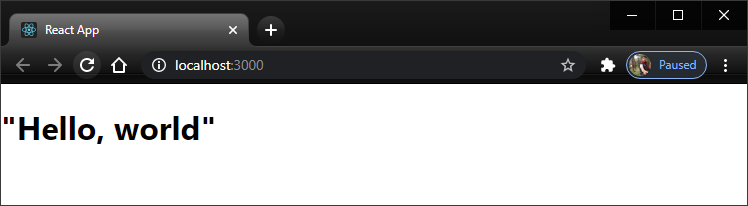

 

### Praktikum 2 : Melakukan Update Render Element

Update Render Element

    function jam() {
    const element = (
        

        <h1>Sekarang Jam:</h1>
        <h2>{new Date().toLocaleTimeString()}</h2>
        

    );
    ReactDOM.render(element, document.getElementById('root'));
    }

    setInterval(jam, 1000);

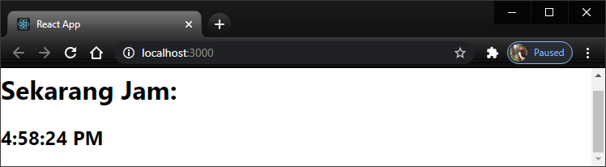

 

### Praktikum 3: Rendering Sebuah Component

 memanggil component Kartu dengan data props

    function Kartu(props) {
    return <h1>Halo, {props.nim} - {props.nama}</h1>;
    }

    const element = <Kartu nama="Agus Salim H" nim="1941723007" />;

    ReactDOM.render(
    element,
    document.getElementById('root')
    );

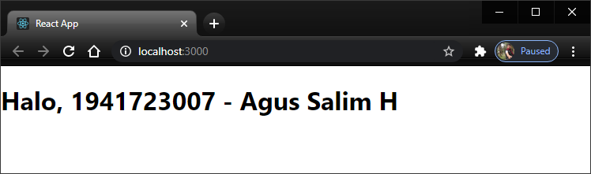

 

### Praktikum 4: Menggabungkan beberapa Components

Memanggil apps.js 

    function Kartu (props) {
    return <h1>Halo, {props.nim} - {props.nama}</h1>;
    }

    function App() {
    return (
        

        <Kartu nim="123" nama="Nama1" />
        <Kartu nim="456" nama="Nama2" />
        <Kartu nim="789" nama="Nama3" />
        

    );
    }

    export default App;

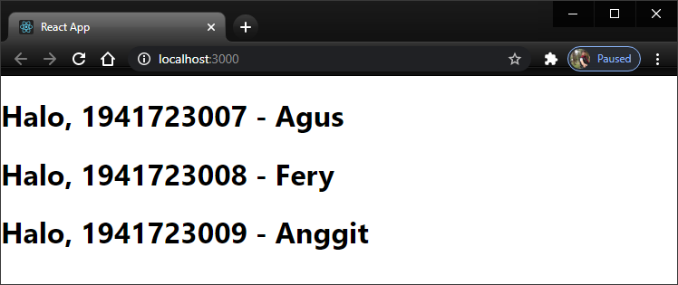

 

### Praktikum 5: Melakukan ekstraksi components

Melakukan ekstrasi

    function Komentar(props) {
    return (
        

        

            
            

            {props.author.name}
            

        

        

            {props.text}
        

        

            {props.date}
        

        

    );
    }

    function App() {
    let me = {name:"Nama Anda", avatarUrl:logo}
    return (
        

        <Komentar text="isi komentar dan NIM Anda" date="20 Februari 2021" author={me} />
        

    );
    }

    export default App;

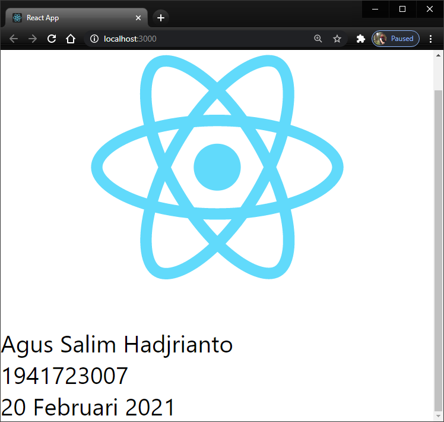

 

State dan Lifecycle

    function Jam(props) {
    return (
        

        <h2>Sekarang jam: {props.date.toLocaleTimeString()}.</h2>
        

    );
    }

    function tick() {
    ReactDOM.render(
        <Jam date={new Date()} />,
        document.getElementById('root')
    );
    }

    setInterval(tick, 1000);

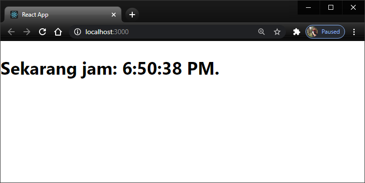

 

### Praktikum 6: Mengubah function menjadi class

    class Jam extends React.Component {
    render() {
        return (
        

            <h1>Halo, 1941723007 - Agus Salim H</h1>
            <h2>Sekarang jam: {this.props.date.toLocaleTimeString()}</h2>
        

        );
    }
    }

Code di atas kosong karena belum di panggil dom

        ReactDOM.render(
        <Jam />,
        document.getElementById('root')
        );
    
Setelah ditambahkan DOM maka akan keluar output sebagai berikut 

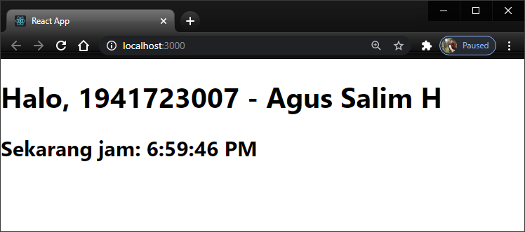

 

Menambahkan method lifecycle ke class

    class Jam extends React.Component {
    constructor(props) {
        super(props);
        this.state = {date: new Date()};
    }

    componentDidMount() {
        this.timerID = setInterval(
        () => this.tick(),
        1000
        );
    }

    componentWillUnmount() {
        clearInterval(this.timerID);
    }

    tick() {
        this.setState({
        date: new Date()
        });
    }
    render() {
        return (
        

            <h1>Halo, 1941723007 - Agus Salim H</h1>
            <h2>Sekarang jam: {this.state.date.toLocaleTimeString()}</h2>
        

        );
    }
    }
    ReactDOM.render(
    <Jam />,
    document.getElementById('root')
    );

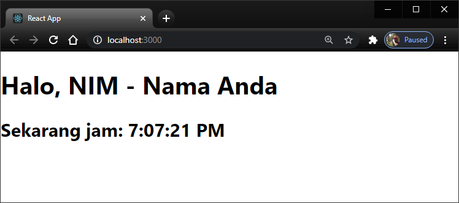

 

[link_All](../../src/02_layout/codelab_03/src/index.js)