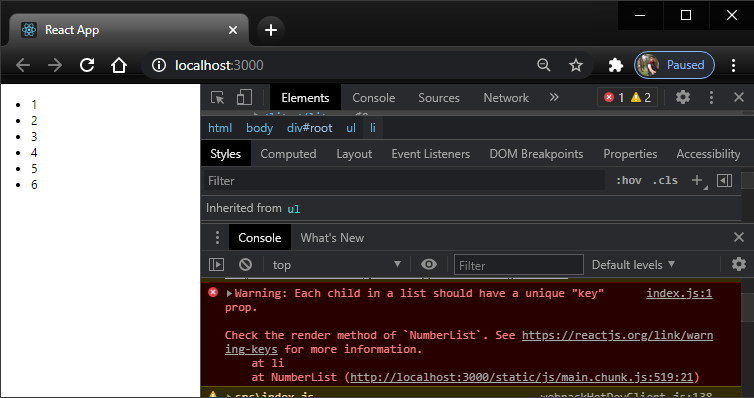
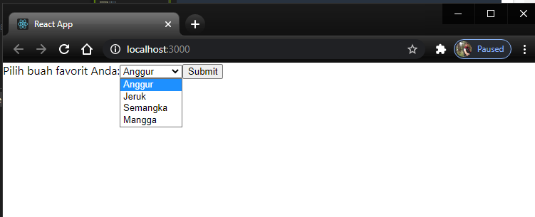

# 04_Konsep_ReactJs_Bagian2

## Tujuan Pembelajaran

1. Mahasiswa paham dengan konsep interaksi didalam reactJS 

## Praktikum 1: Menangani events pada toggle button

### Cara 1: Membuat toggle button dengan binding this

Pertama akan muncul

Lalu setelah di klik maka akan muncul

### Cara 2: Membuat toggle button dengan class field dan arrow function

### Cara 3: Membuat toggle button dengan arrow function saat pemanggilan

ON

OFF

## Praktikum 2: Rendering login secara kondisional

## Praktikum 3: Menyimpan elements dengan variabel

lOGIN

lOGOUT

## Praktikum 4: Komponen list dasar

Eror saat inspect element

Perbaikan

## Praktikum 5: Membuat unique keys

## Praktikum 6: Membuat form dengan controlled components

Krika di submit maka akan muncul pop up

### Membuat textarea pada form

ubah render

### Membuat select pada form

### Membuat multiple select

Multiple true

