# 05 API dan Router di ReactJs

## Tujuan Pembelajaran

1. Mahasiswa paham dengan cara instalasi reactrouter 
2. Mahasiswa dapat mengetahui konsep reactrouter 

## Praktikum 1: Menampilkan data dari API

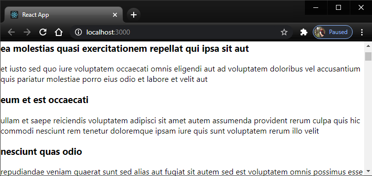

## Praktikum 2: Membuat routing sederhana

Install React Router terlebih dahulu dengan npm pada terminal atau console Anda:

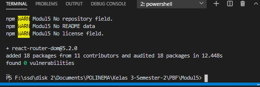

menambah router dom

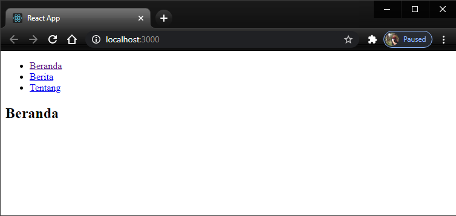

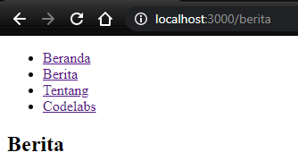

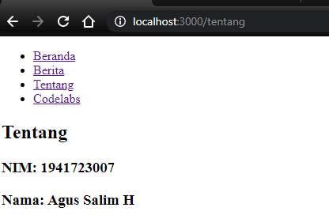

### Praktikum 3: Membuat routing bersarang (Nested Routing)

Beranda

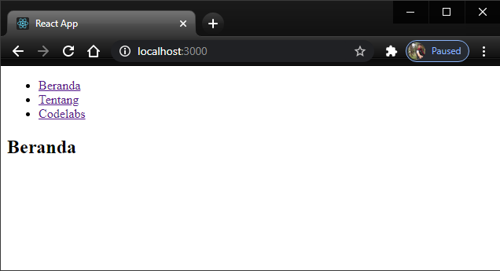

Tentang

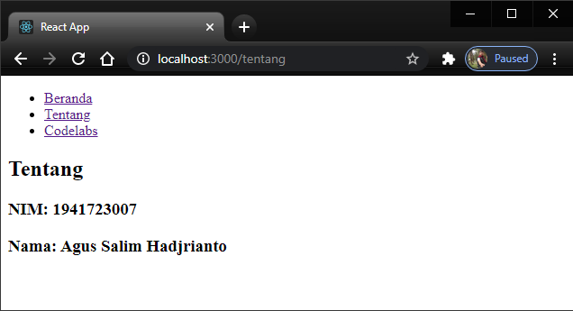

Codelabs

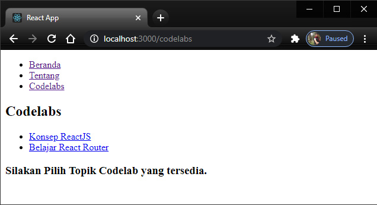

Konsep ReactJS

Belajar React Router

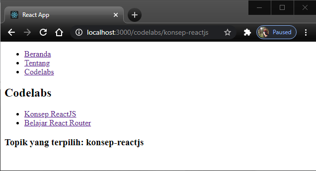

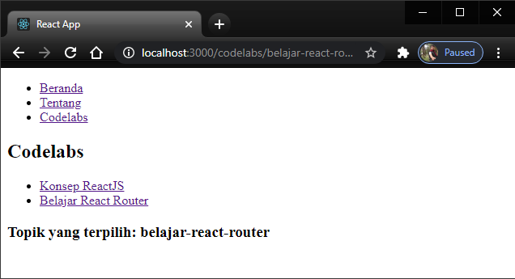

## TUGAS

Home

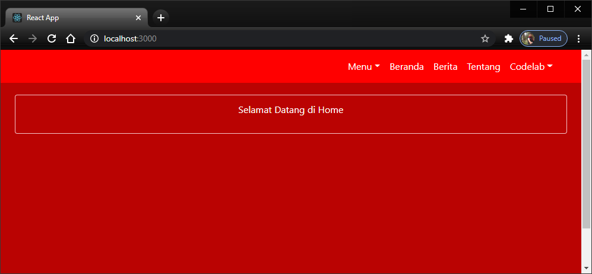

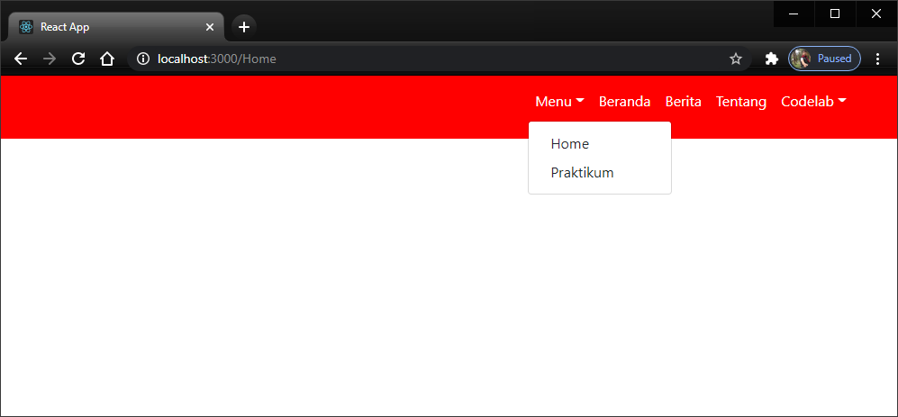

Beranda

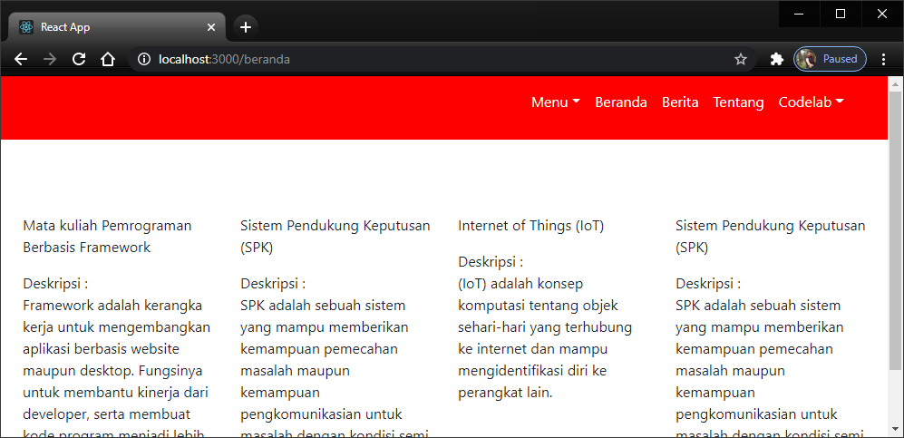

Berita

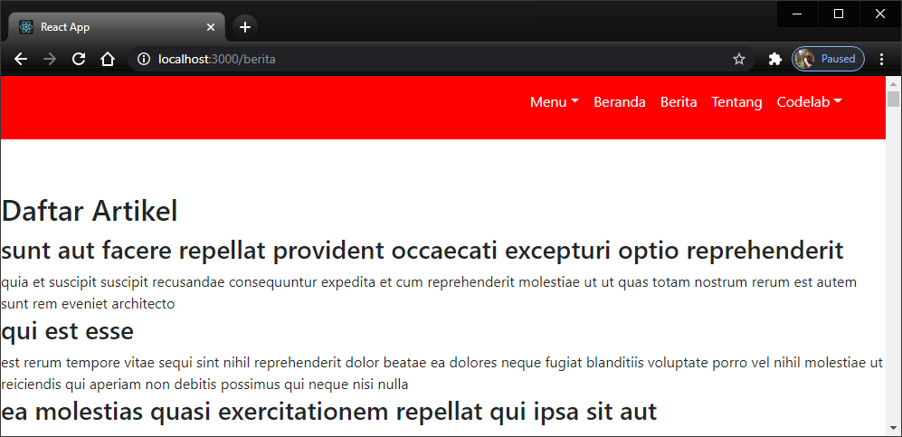

Tentang

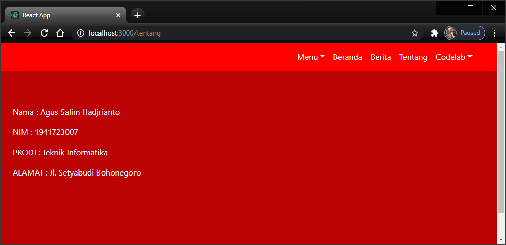

Codelabs

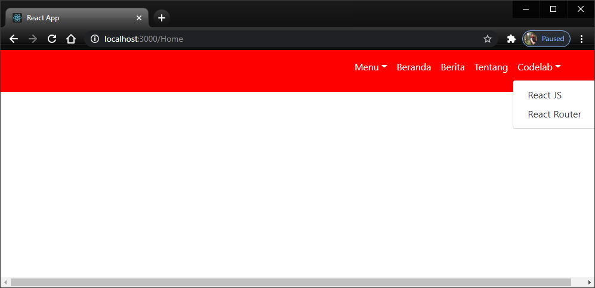

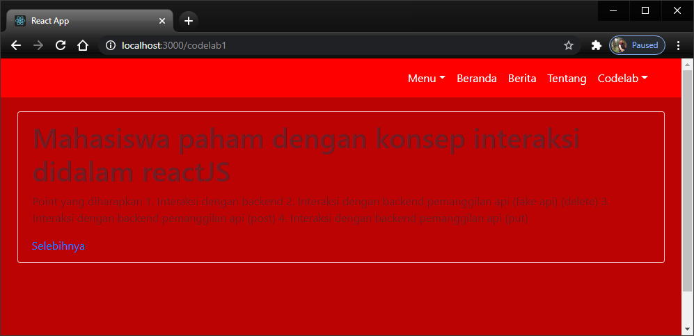

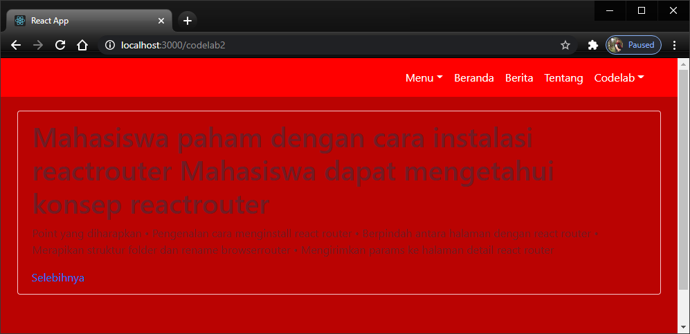