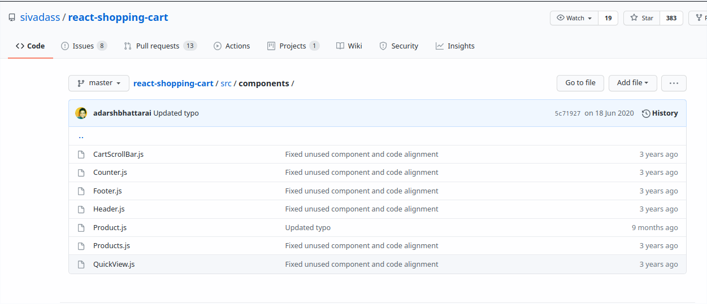
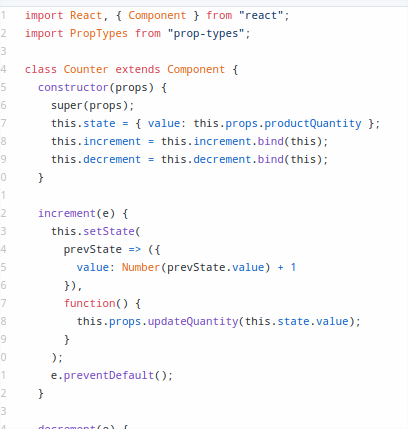

# 06 - React Redux

## Tujuan Pembelajaran

1. Mahasiswa dapat memahami konsep state management dalam redux
2. Mahasiswa dapat menerapkan redux dalam reactapp 

### Praktikum: Membuat Aplikasi Counter Sederhana

1. Intalasi react

'npx create-react-app counter-app-03'

2. App.js

3. Export counter

4. Index.js

5. Tampilan

6. Install redux

7. Hapus state dan di ganti dengan fungsi redux

8. Membuat fungsi redux dengan nilai count 42

9. Tampilan count 42 STATIS

10. Menambah variabel initialState dan ganti paramater serta isi fungsi reducer

'Tampilan'

11. Edit App.js untuk menambah increment dan discrement

'Tampilan'

### Tugas (Pertanyaan Praktikum)

    Berdasarkan pada praktikum sebelumnya yang telah dilakukan, beberapa pertanyaan terkait praktikum perlu diselesaikan yaitu sebagai berikut :

    1. Jelaskan maksud sintaks this.props.dispatch pada praktikum langkah 16 sebelumnya!

        Jawab :

            Fungsi dari sintacks di atas ialah untuk memanggil fungsi dari index ke app.js pada fungsi reducer yang telah di inisialisasi dan di case untuk bisa di panggil pada increment dan descrement .

    2. Jelaskan maksud istilah yang ada dalam Redux berikut ini:
    Actions

        a. Reducers
        
            Ialah penggunaan fungsi di mana digunakan untuk menangani case yang banyak dan di persingkat atau di persimple dengan menggunkan fungsi redux pada reactJs

        b. Action creators

            Digunakan untuk berinteraksi pada fungsi counter dimana jika di klik maka akan ada action tambah atau kurang

        c. Middleware
        
            Digunakan untuk menghubungkan koneksi dari fungsi

        d. Pure functions

            Digunakan untuk membangun suatu fungsi

        f. Immutability

            Tipe variabel concrit atau tidak bisa di ubah contohnya String dan Number

    3. Jelaskan maksud sintaks export default connect(mapStateToProps)(Counter) pada praktikum langkah 9 sebelumnya!

        Jawab :

            Digunakann untuk mengembalikan fungsi ke default counter dari mapStateProps

    4. Carilah sebuah studi kasus aplikasi yang cukup kompleks di GitHub yang memanfaatkan Redux! Kemudian screenshot bagian kode program mana yang merupakan proses Redux dan jelaskan prosesnya! (cantumkan link repository GitHub yang Anda temukan)

Judul : React Shopping Cart

'Tampilan'

Link : https://github.com/sivadass/react-shopping-cart

