# Context dan HOC di ReactJS

## Context API

1. React.createContext

2. Context.Provider

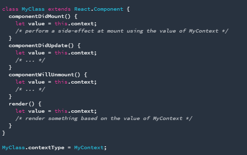

3. Context.Consumer

4. Context.displayName

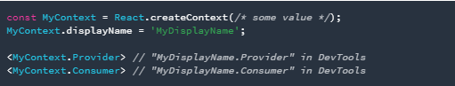

### Praktikum : Membuat Tema Aplikasi Sederhana

Hasil yang di harapkan

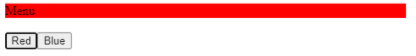

1. Instalasi

2. Create folder

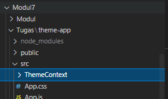

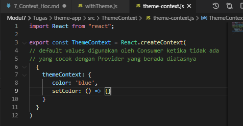

3. Buatlah file theme-context.js di src/ThemeContext

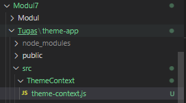

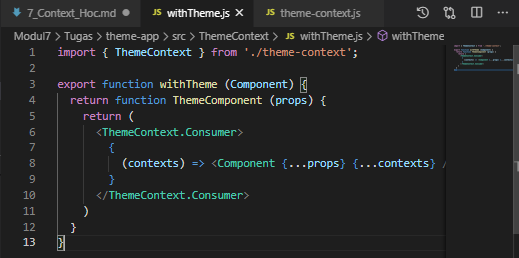

4. Lalu buatlah file withTheme.js di src/ThemeContext

5. Kemudian buatlah file ThemeProvider.js di src/ThemeContext

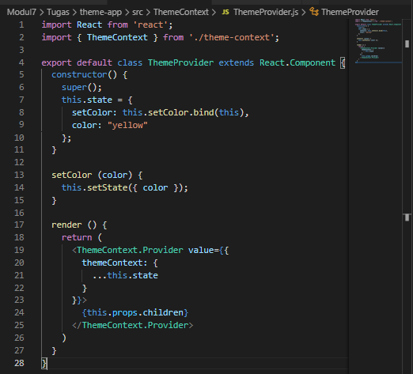

6. Selanjutnya buatlah file di src/Menu.js dengan kode berikut ini

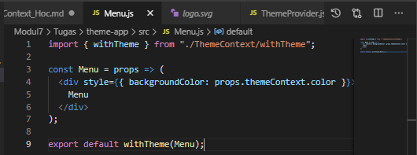

7. Lalu buatlah file di src/SetColor.js dengan kode berikut ini.

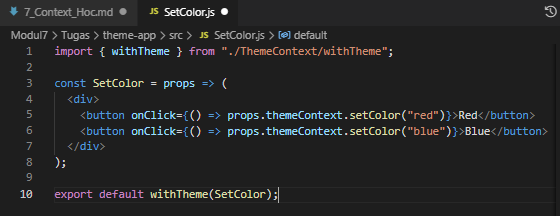

8. Akhirnya file src/App.js

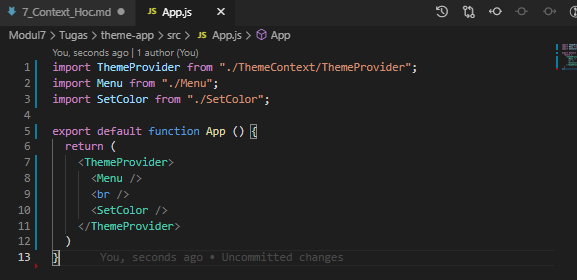

9. Struktur file dan folder Anda di folder src seharusnya seperti berikut:

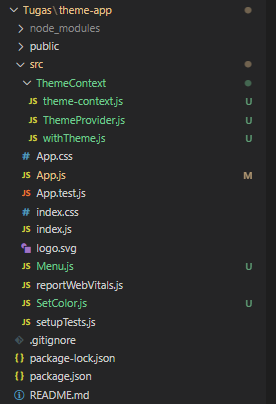

10. Output

Tampilan Awal

'Tampilan Awal'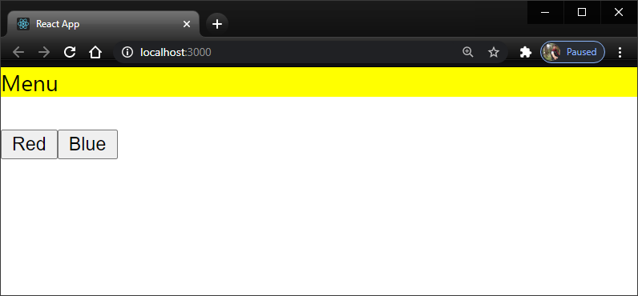

Klik Red

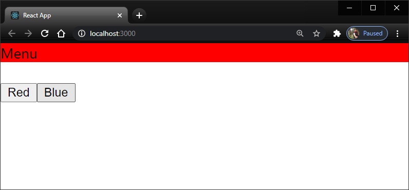

Klik Blue

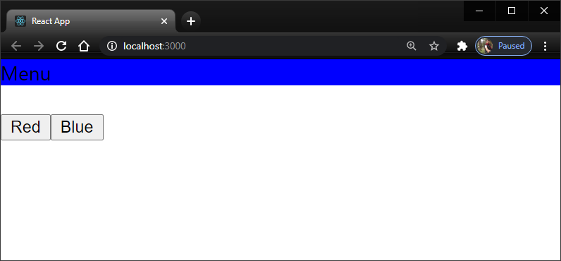