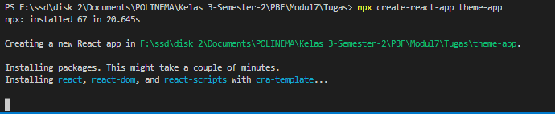

# Context dan HOC di ReactJS

## Context API

1. React.createContext

2. Context.Provider

3. Context.Consumer

4. Context.displayName

### Praktikum : Membuat Tema Aplikasi Sederhana

*** Instalasi ***

