# LAPORAN UJIAN TENGAH SEMESTER PEMROGRAMAN BERBASIs FRAMEWORK

## Penilaian 
1. 	Aplikasi React (SPA)

2. 	Menggunakan React Router setiap menu

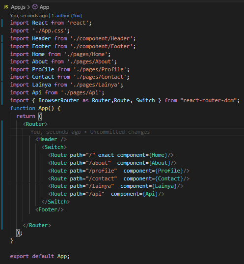

3. 	Menggunakan API ke file JSON

`Code`

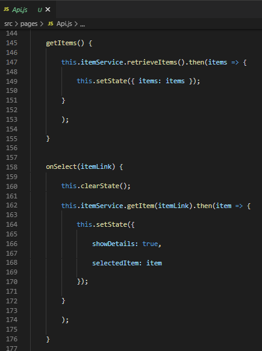

`Tampilan`

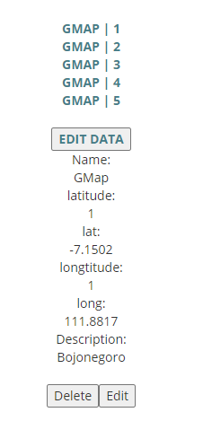

4. 	Menggunakan Redux 

Pertama bisa terus saya coba atur lagi struktur sesuai no 5 ternya malah eror akhirnya saya hapus reduxnya,.

`Sebelum`

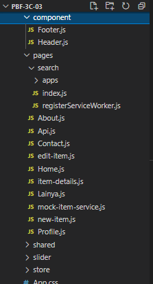

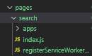

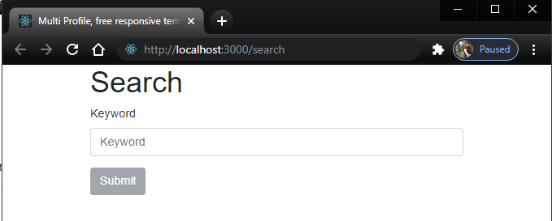

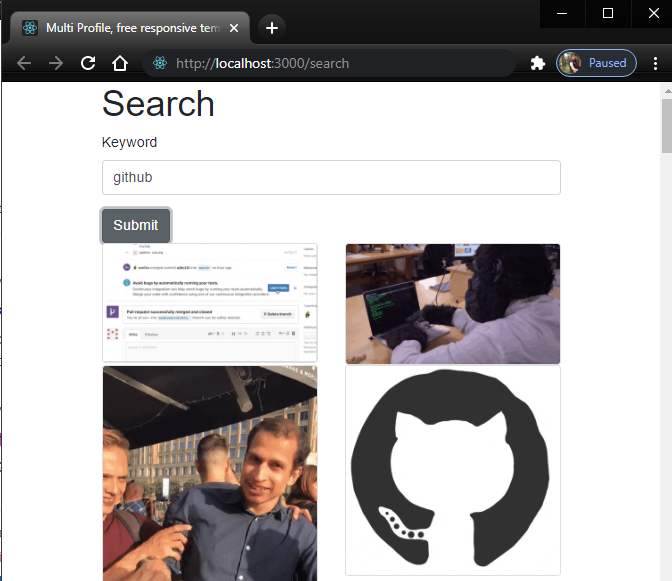

5. 	React Project Structure Best Practices for Scalable Application 

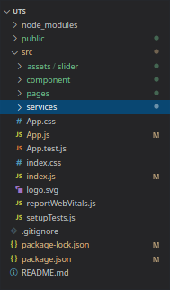

6. 	Ketepatan pengumpulan solusi, kerapian laporan dan penulisan 

Sesuai
## Tampilan

### Home

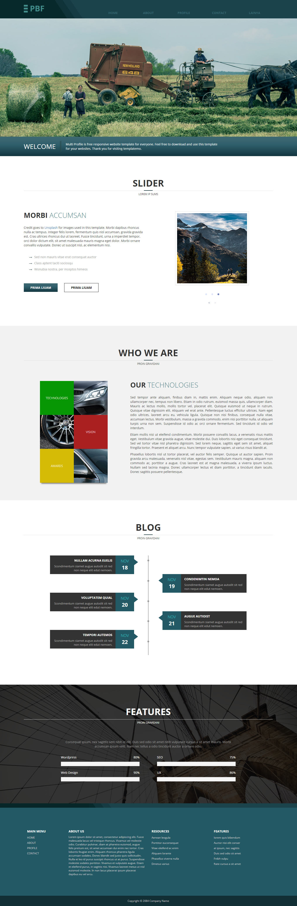

### About

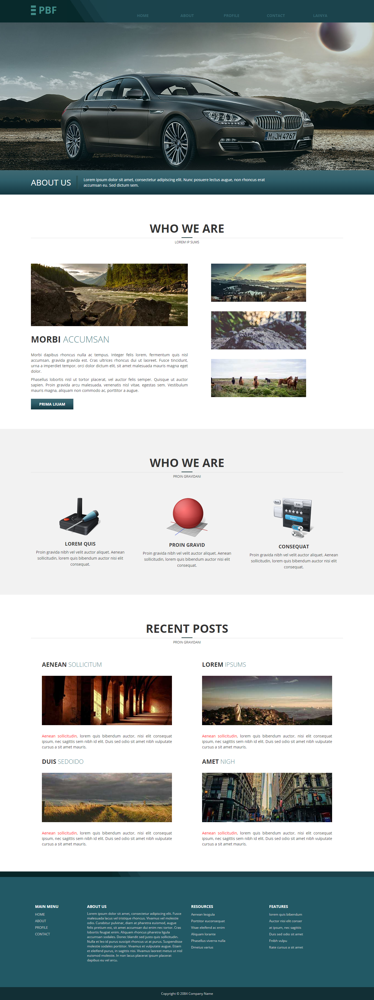

### Profile

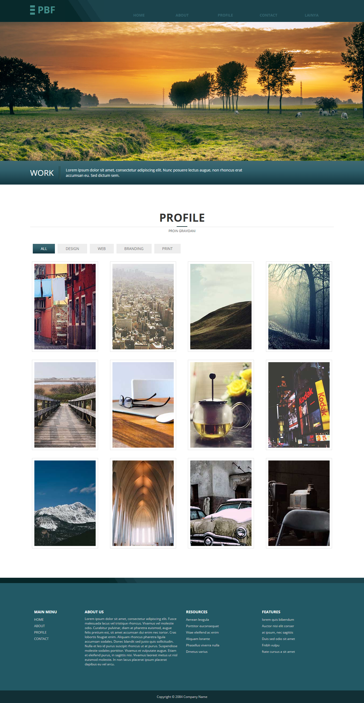

### Contact

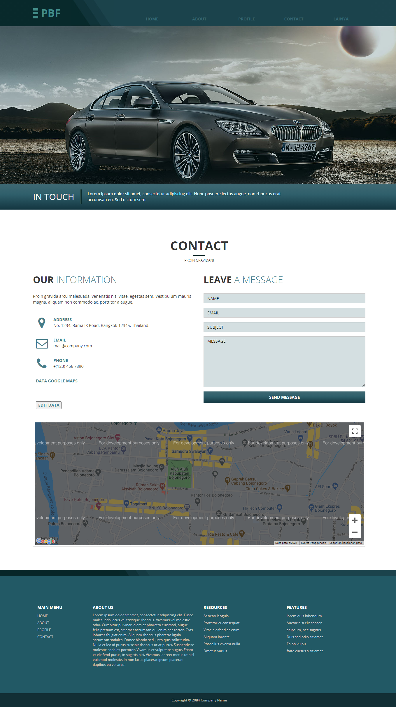

### Lainya

## Struktur

### Component

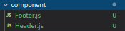

### Assets

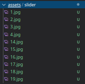

### Pages

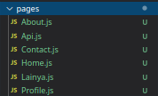

### Services

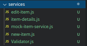