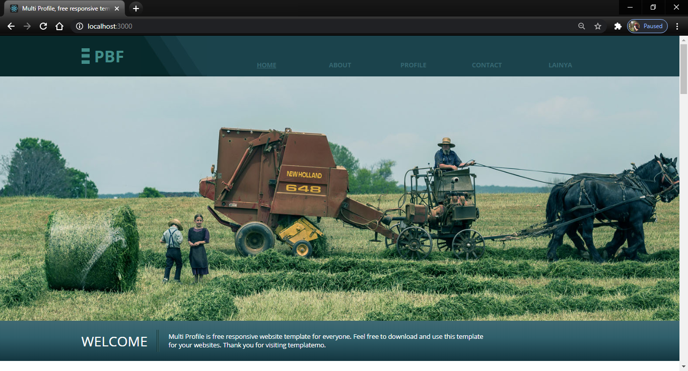

# LAPORAN UTS PEMROGRAMAN BERBASIS FRAMEWORK

1. Instalasi React 

Caranya dengan 

    <b>npx create-react-app uts_003</b>

2. Konversi Template 003_templatemo_457_multi_profile menjadi program di react framework

# hasil

