# LAPORAN UTS PEMROGRAMAN BERBASIS FRAMEWORK

### Instalasi React 

Caranya dengan 

    <b>npx create-react-app uts_003</b>

### Konversi Template 003_templatemo_457_multi_profile menjadi program di react framework

Code : Public/index.html

            <!DOCTYPE html>
            <html lang="en">

            <head>
                <meta charset="utf-8">
                <meta http-equiv="X-UA-Compatible" content="IE=edge">
                <meta name="viewport" content="width=device-width, initial-scale=1">
                <title>Multi Profile, free responsive template</title>
                <meta name="description" content="">
                <link href='http://fonts.googleapis.com/css?family=Open+Sans:400,300,400italic,700' rel='stylesheet'
                    type='text/css'>
                <link href="assets/css/bootstrap.min.css" rel="stylesheet">
                <link href="assets/css/font-awesome.min.css" rel="stylesheet">
                <link href="assets/css/templatemo-style.css" rel="stylesheet">
            </head>

            <body>
                <!-- <noscript>You need to enable JavaScript to run this app.</noscript> -->
                

                <!-- Home -->
                <!-- JS -->
                 <!-- jQuery -->
                 <!-- Carousel -->
                 <!-- Templatemo Script -->
                

                <!-- About -->
                <!-- JS -->
                
                

                <!-- Profile -->
                <!-- JS -->
                 <!-- jQuery -->
                
                <!-- Isotope, http://isotope.metafizzy.co -->
                 <!-- Templatemo Script -->
                

                <!-- Contact -->
                <!-- JS -->
                 <!-- jQuery -->
                 <!-- Templatemo Script -->
                

                <!-- Data Lat Long -->

                

            </body>

            </html>

### Langkah pertama membuat router untuk akses ke header footer dan component

1. Code : App.js

        import React from 'react';
        import './App.css';
        import Header from './component/Header';
        import Footer from './component/Footer';
        import Home from './pages/Home';
        import About from './pages/About';
        import Profile from './pages/Profile';
        import Contact from './pages/Contact';
        import Lainya from './pages/Lainya';
        import Api from './pages/Api';
        import Search from './pages/search/apps/components/search';
        import { BrowserRouter as Router,Route, Switch } from "react-router-dom";
        function App() {
        return (
            <Router>

                <Header />
                <Switch>
                    <Route path="/" exact component={Home}/>
                    <Route path="/about"  component={About}/>
                    <Route path="/profile"  component={Profile}/>
                    <Route path="/contact"  component={Contact}/>
                    <Route path="/lainya"  component={Lainya}/>
                    <Route path="/api"  component={Api}/>
                    <Route path="/search"  component={Search}/>
                </Switch>
                <Footer/>

            </Router>
        );
        }

        export default App;

2. Code : Index.js

        import React from 'react';
        import ReactDOM from 'react-dom';
        import App from './App';
        import reportWebVitals from './reportWebVitals';

        ReactDOM.render(
        <React.StrictMode>
            <App />
        </React.StrictMode>,
        document.getElementById('root')
        );

        reportWebVitals();

3. Code : component/Header.js

        import React, { Component } from 'react';
        import { Link } from 'react-router-dom';
        class Header extends React.Component {
            render() {
                return (
                    

                        

                            

                                

                                    

                                        
                                        <h1 class="site-name">PBF</h1>
                                    

                                    

                                        <i class="fa fa-bars"></i>
                                    

                                    

                                        <nav class="templatemo-nav">
                                            <ul>
                                                <li><Link to="/" class="interactive">Home</Link></li>
                                                <li><Link to="/about" >About</Link></li>
                                                <li><Link to="/profile">Profile</Link></li>
                                                <li><Link to="/contact">Contact</Link></li>
                                                <li><Link to="/lainya">Lainya</Link></li>
                                            </ul>
                                        </nav>
                                    

                                

                            

                        

                    

                )
            }
        }

        export default Header;

4. Code : component/Footer.js

        import React, { Component } from 'react';
        import { Link } from 'react-router-dom';

        class Footer extends React.Component {
            render() {
                return (
                    

                        <section class="templatemo-container blue-bg footer-nav effect1">
                            

                                

                                    <h3 class="text-uppercase">Main menu</h3>
                                    <nav class="text-uppercase templatemo-nav-2">
                                        <ul>
                                            <li><Link to="/">home</Link></li>
                                            <li><Link to="/about">About</Link></li>
                                            <li><Link to="/profile">Profile</Link></li>
                                            <li><Link to="/contact">Contact</Link></li>
                                        </ul>
                                    </nav>
                                

                                

                                    <h3 class="text-uppercase">About us</h3>
                                    
Lorem ipsum dolor sit amet, consectetur adipiscing elit. Fusce malesuada lacus vel tristique rhoncus. Vivamus vel molestie odio. Curabitur pulvinar, diam at pharetra euismod, augue felis pretium est, sit amet accumsan dui enim nec tortor. Cras lobortis feugiat enim. Aliquam rhoncus pharetra ligula accumsan sodales. Donec blandit sed justo quis sollicitudin. Nulla et leo id purus suscipit rhoncus ut at purus. Suspendisse molestie sodales porttitor.

                                Vivamus et vulputate augue. Etiam et eleifend purus, in sagittis nisi. Vivamus laoreet metus ut nisl euismod molestie. In non lacus placerat ipsum placerat dapibus eu vel arcu.

                                

                                

                                    <h3 class="text-uppercase">Resources</h3>
                                    <ul>
                                        <li><Link to="#">Aenean leogula</Link></li>
                                        <li><Link to="#">Porttitor euconsequat</Link></li>
                                        <li><Link to="#">Vitae eleifend ac enim</Link></li>
                                        <li><Link to="#">Aliquam lorante</Link></li>
                                        <li><Link to="#">Phasellus viverra nulla</Link></li>
                                        <li><Link to="#">Dmetus varius</Link></li>
                                    </ul>
                                

                                

                                    <h3 class="text-uppercase">Features</h3>
                                    <ul>
                                        <li><Link to="#">lorem quis bibendum</Link></li>
                                        <li><Link to="#">Auctor nisi elit conser</Link></li>
                                        <li><Link to="#">at ipsum, nec sagittis</Link></li>
                                        <li><Link to="#">Duis sed odio sit amet</Link></li>
                                        <li><Link to="#">Fnibh vulpu</Link></li>
                                        <li><Link to="#">ftate cursus a sit amet</Link></li>
                                    </ul>
                                

                            

                        </section>
                        <footer class="text-center">
                            
Copyright &copy; 2084 Company Name

                        </footer>
                    

                )
            }
        }

        export default Footer;

5. Code : pages/Home.js

            import React, { Component } from 'react';
            import { Link } from 'react-router-dom';
            import AliceCarousel from 'react-alice-carousel';
            import "react-alice-carousel/lib/alice-carousel.css";
            import image1 from '../slider/1.jpg';
            import image2 from '../slider/2.jpg';
            import image3 from '../slider/3.jpg';
            class Home extends React.Component {
                render() {
                    return (
                        

                            

                            

                                

                                    

                                        

                                            

                                                <h2 class="welcome-title text-uppercase">Welcome</h2>
                                                
                                                
Multi Profile is free responsive website template for everyone. Feel free to download and use this template for your websites. Thank you for visiting templatemo.

                                            

                                        

                                    

                                

                            

                            {/* Welcome message 
                    main content  */}
                            <section class="templatemo-container section-shadow-bottom">
                                

                                    

                                        

                                            <h2 class="section-title">Slider</h2>
                                            

                                            

                                            
Lorem ip sums

                                        

                                    

                                    

                                        

                                            <h3 class="section-title-2 text-uppercase font-weight-300"><b>Morbi</b> Accumsan</h3>
                                            
Credit goes to <Link to="http://unsplash.com">Unsplash</Link> for images used in this template. Morbi dapibus rhoncus nulla ac tempus. Integer felis lorem, fermentum quis nisl accumsan, gravida gravida est. Cras ultrices rhoncus dui ut laoreet. Fusce tincidunt, urna a imperdiet tempor, orci dolor dictum elit, sit amet malesuada mauris magna eget dolor. Morbi ornare convallis vulputate. Donec ut suscipit nisl, ac elementum nisi.

                                            <ul class="gray-text ul-1">
                                                <li>Sed non mauris vitae erat consequat auctor</li>
                                                <li>Class aptent taciti sociosqu</li>
                                                <li>Wonubia nostra, per inceptos himeos</li>
                                            </ul>
                                            <Link to="#" class="btn-blue-gradient">Prima Liuam</Link>
                                            <Link to="#" class="btn-transparent">Prima Liuam</Link>
                                        

                                        

                                            

                                                

                                                    

                                                        {/* <figure class="crsl-item">
                                                            
                                                        </figure>
                                                        <figure class="crsl-item">
                                                            
                                                        </figure>
                                                        <figure class="crsl-item">
                                                            
                                                        </figure> */}
                                                        <AliceCarousel autoPlay autoPlayInterval="3000" class="crsl-item">
                                                            
                                                            
                                                            
                                                        </AliceCarousel>
                                                    

                                                

                                            

                                            {/* <!-- carousel-container --> */}

                                        

                                    

                                    {/* end section content  */}
                                

                            </section>
                            {/* <!-- Who We Are --> */}
                            <section class="templatemo-container light-gray-bg section-shadow-bottom">
                                

                                    

                                        

                                            <h2 class="section-title">Who we are</h2>
                                            

                                            

                                            
Proin Gravidani

                                        

                                    

                                    {/* <!-- row --> */}
                                    

                                        

                                            

                                                

                                                    <Link to="#" class="tm-block-link">Technologies</Link>
                                                

                                                

                                                    
                                                

                                                

                                                    
                                                

                                                

                                                    <Link to="#" class="tm-block-link">Vision</Link>
                                                

                                                

                                                    <Link to="#" class="tm-block-link">Awards</Link>
                                                

                                                

                                                    
                                                

                                            

                                        

                                        

                                            <h3 class="section-title-2 text-uppercase font-weight-300"><b>Our</b> Technologies</h3>
                                            
Sed tempor ante aliquam, finibus diam in, mattis enim. Aliquam neque odio, aliquam non ullamcorper nec, tempus non libero. Etiam in odio rutrum, euismod massa quis, ullamcorper diam. Mauris ac lectus mollis, mollis tortor vel, placerat elit. Quisque euismod ut neque in rutrum. Quisque vitae dignissim elit. Aliquam vel erat ante. Pellentesque luctus efficitur ultrices. Nam eget odio ultrices, laoreet arcu eu, vehicula ligula. Quisque non nisi finibus, consequat nulla vitae, accumsan lectus. Morbi vestibulum, massa a gravida commodo, enim nisi porttitor nulla, ut aliquam turpis urna non sem. Suspendisse id odio ac orci ornare fermentum. Sed tincidunt id odio vel interdum.

                                            

                                                Etiam mollis nisi ut eleifend condimentum. Morbi posuere convallis lacus, a venenatis risus mattis eget. Vestibulum vitae gravida augue, vitae molestie dui. Duis lobortis nisi eget consequat tincidunt. Sed vel tortor vitae nisl pharetra dignissim. Sed lorem neque, sagittis eget sem sit amet, aliquet fringilla tortor. Praesent et aliquet arcu. Nunc tempor vulputate sapien, ut varius risus blandit at.
                                    

                                            

                                                Phasellus lobortis nisl ut tortor placerat, vel auctor felis semper. Quisque ut auctor sapien. Proin gravida arcu malesuada, venenatis nisl vitae, egestas sem. Vestibulum mauris magna, aliquam non commodo ac, porttitor a augue. Cras laoreet est at magna malesuada, a viverra ipsum luctus. Nullam sed lacinia magna. Donec ullamcorper lectus et diam porttitor, a tincidunt diam iaculis. Donec sagittis posuere pellentesque.

                                        

                                    

                                

                            </section>
                            {/* <!-- Blog --> */}
                            <section class="templatemo-container">
                                

                                    

                                        

                                            <h2 class="section-title">Blog</h2>
                                            

                                            

                                            
Proin Gravidani

                                        

                                    

                                    

                                        

                                            

                                                <h3 class="post-title">Nullam Acurna Euelis</h3>
                                                
Scondimentum siamet augue autodit sit red non neque elit edut nemoen.

                                            

                                            

                                                
Nov

                                                
18

                                            

                                            

                                                
                                            

                                        

                                        

                                            

                                                
                                            

                                            

                                                
Nov

                                                
19

                                            

                                            

                                                <h3 class="post-title">Condenimtin nemoa</h3>
                                                
Scondimentum siamet augue autodit sit red non neque elit edut nemoen.

                                            

                                        

                                        

                                            

                                                <h3 class="post-title">Voluptatem Quial</h3>
                                                
Scondimentum siamet augue autodit sit red non neque elit edut nemoen.

                                            

                                            

                                                
Nov

                                                
20

                                            

                                            

                                                
                                            

                                        

                                        

                                            

                                                
                                            

                                            

                                                
Nov

                                                
21

                                            

                                            

                                                <h3 class="post-title">Augue Autioist</h3>
                                                
Scondimentum siamet augue autodit sit red non neque elit edut nemoen.

                                            

                                        

                                        

                                            

                                                <h3 class="post-title">Tempori Autemos</h3>
                                                
Scondimentum siamet augue autodit sit red non neque elit edut nemoen.

                                            

                                            

                                                
Nov

                                                
22

                                            

                                            

                                                
                                            

                                        

                                    

                                

                            </section>
                            {/* <!-- Features --> */}
                            <section class="templatemo-container features">
                                

                                    

                                        

                                            <h2 class="section-title">Features</h2>
                                            

                                            

                                            
Proin Gravidani

                                        

                                    

                                    

                                        

                                            
Consequat ipsum, nex sagittis sem nibh id elit. Duis sed odio sit amet nibh vulputate cursus a sit amet mauris. Morbi accumsan ipsum velit. Nam nec tellus a odio tincidunt auctor a ornare odio.

                                            

                                                

                                                    
Wordpress

                                                    
80%

                                                

                                                

                                                    

                                                        80% Complete
                                                    

                                                

                                            

                                            

                                                

                                                    
SEO

                                                    
75%

                                                

                                                

                                                    

                                                        75% Complete
                                                    

                                                

                                            

                                            

                                                

                                                    
Web Design

                                                    
90%

                                                

                                                

                                                    

                                                        90% Complete
                                                    

                                                

                                            

                                            

                                                

                                                    
UX

                                                    
86%

                                                

                                                

                                                    

                                                        86% Complete
                                                    

                                                

                                            

                                        

                                    

                                

                                

                            </section>
                            

                                

                                

                                

                            

                        

                    );
                }
            }

            export default Home;

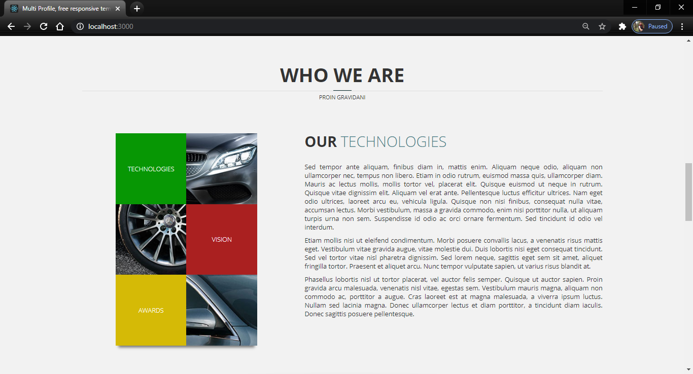

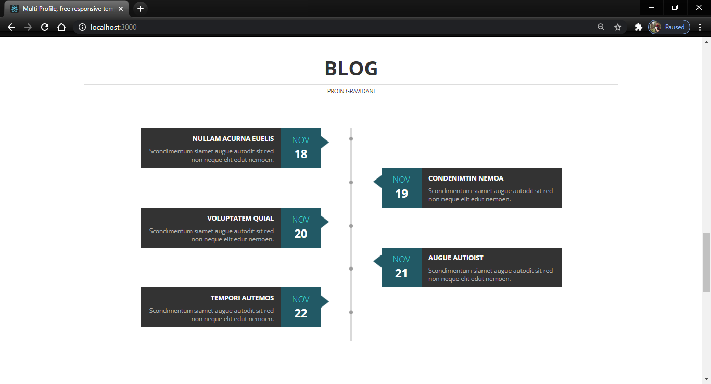

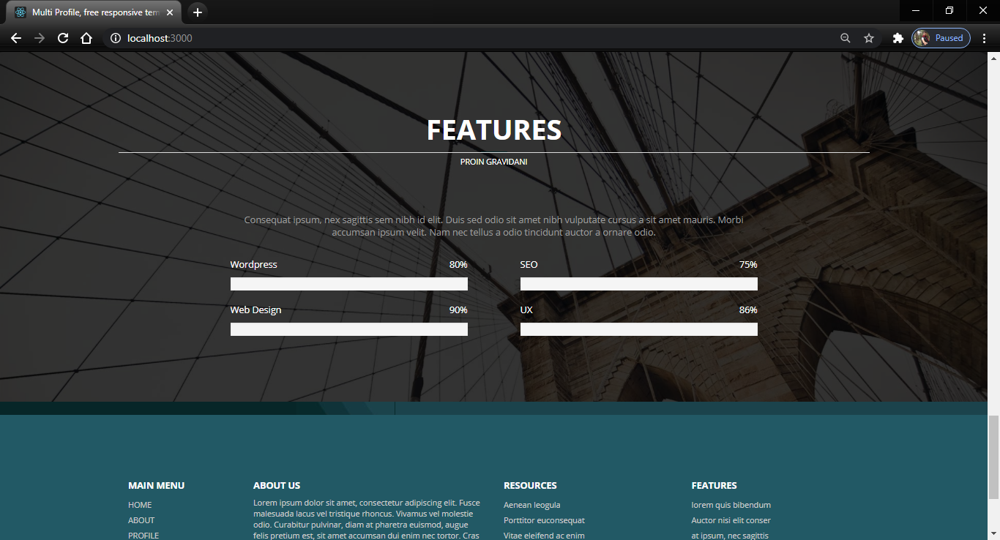

6. Code : pages/About.js

            import React, { Component } from 'react';
            import { Link } from 'react-router-dom';
            class About extends React.Component {
                render() {
                    return (
                        

                            

                            {/* <!-- end header image -->
                    <!-- Welcome message --> */}
                            

                                

                                    

                                        

                                            

                                                <h2 class="welcome-title text-uppercase">About Us</h2>
                                                
                                                
Lorem ipsum dolor sit amet, consectetur adipiscing elit. Nunc posuere lectus augue, non rhoncus erat accumsan eu. Sed dictum sem.

                                            

                                        

                                    

                                

                            

                            {/* <!-- Welcome message -->
                    <!-- main content --> */}
                            <section class="templatemo-container section-shadow-bottom">
                                

                                    

                                        

                                            <h2 class="section-title">Who We Are</h2>
                                            

                                            

                                            
Lorem ip sums

                                        

                                    

                                    

                                        

                                            
                                            <h3 class="section-title-2 text-uppercase font-weight-300"><b>Morbi</b> Accumsan</h3>
                                            
Morbi dapibus rhoncus nulla ac tempus. Integer felis lorem, fermentum quis nisl accumsan, gravida gravida est. Cras ultrices rhoncus dui ut laoreet. Fusce tincidunt, urna a imperdiet tempor, orci dolor dictum elit, sit amet malesuada mauris magna eget dolor.

                                            
Phasellus lobortis nisl ut tortor placerat, vel auctor felis semper. Quisque ut auctor sapien. Proin gravida arcu malesuada, venenatis nisl vitae, egestas sem. Vestibulum mauris magna, aliquam non commodo ac, porttitor a augue.

                                            <Link to="#" class="btn-blue-gradient">Prima Liuam</Link>
                                        

                                        

                                            

                                                

                                                    
Feufelisda

                                                    
Nullam Acurna

                                                

                                                
                                            

                                            

                                                

                                                    
Feufelisda

                                                    
Nullam Acurna

                                                

                                                
                                            

                                            

                                                

                                                    
Feufelisda

                                                    
Nullam Acurna

                                                

                                                
                                            

                                        

                                    

                                

                            </section>
                            <section class="templatemo-container light-gray-bg section-shadow-bottom">
                                

                                    

                                        

                                            <h2 class="section-title">Who we are</h2>
                                            

                                            

                                            
Proin Gravidani

                                        

                                    

                                    {/* <!-- row --> */}
                                    

                                        

                                            
                                            <h3 class="text-uppercase about-h3">Lorem Quis</h3>
                                            
Proin gravida nibh vel velit auctor aliquet. Aenean sollicitudin, lorem quis bibendum auctor nisi elit consequat.

                                        

                                        

                                            
                                            <h3 class="text-uppercase about-h3">Proin Gravid</h3>
                                            
Proin gravida nibh vel velit auctor aliquet. Aenean sollicitudin, lorem quis bibendum auctor nisi elit consequat.

                                        

                                        

                                            
                                            <h3 class="text-uppercase about-h3">Consequat</h3>
                                            
Proin gravida nibh vel velit auctor aliquet. Aenean sollicitudin, lorem quis bibendum auctor nisi elit consequat.

                                        

                                    

                                

                            </section>
                            <section class="templatemo-container">
                                

                                    

                                        

                                            <h2 class="section-title">Recent Posts</h2>
                                            

                                            

                                            
Proin Gravidani

                                        

                                    

                                    

                                        

                                            

                                                <h3 class="text-uppercase recent-post-title margin-bottom-30">Aenean Sollicitum</h3>
                                                
                                                
Aenean sollicitudin, lorem quis bibendum auctor, nisi elit consequat ipsum, nec sagittis sem nibh id elit. Duis sed odio sit amet nibh vulputate cursus a sit amet mauris.

                                            

                                        

                                        

                                            

                                                <h3 class="text-uppercase recent-post-title margin-bottom-30">Lorem Ipsums</h3>
                                                
                                                
Aenean sollicitudin, lorem quis bibendum auctor, nisi elit consequat ipsum, nec sagittis sem nibh id elit. Duis sed odio sit amet nibh vulputate cursus a sit amet mauris.

                                            

                                        

                                        

                                            

                                                <h3 class="text-uppercase recent-post-title margin-bottom-30">Duis Sedoido</h3>
                                                
                                                
Aenean sollicitudin, lorem quis bibendum auctor, nisi elit consequat ipsum, nec sagittis sem nibh id elit. Duis sed odio sit amet nibh vulputate cursus a sit amet mauris.

                                            

                                        

                                        

                                            

                                                <h3 class="text-uppercase recent-post-title margin-bottom-30">Amet Nigh</h3>
                                                
                                                
Aenean sollicitudin, lorem quis bibendum auctor, nisi elit consequat ipsum, nec sagittis sem nibh id elit. Duis sed odio sit amet nibh vulputate cursus a sit amet mauris.

                                            

                                        

                                    

                                

                            </section>
                            

                                

                                

                                

                            

                        

                    );
                }
            }

            export default About;

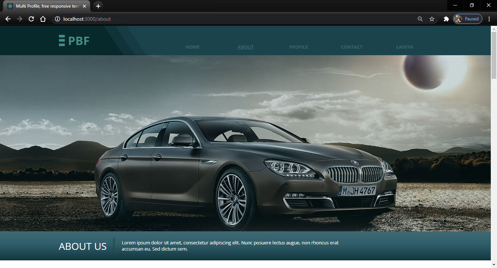

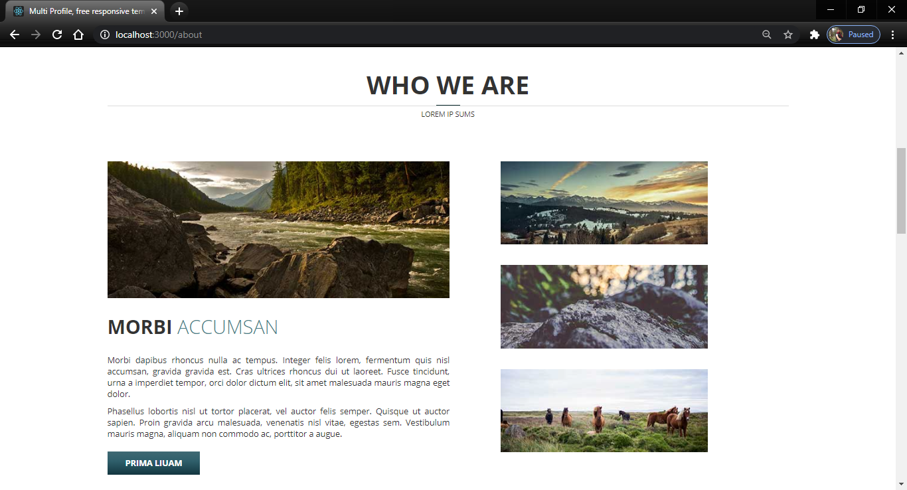

7. Code : pages/Profile.js

            import React, { Component } from 'react';
            import { Link } from 'react-router-dom';
            class Profile extends React.Component {
                render() {
                    return (
                        

                            

                            

                                

                                    

                                        

                                            

                                                <h2 class="welcome-title text-uppercase">Work</h2>
                                                
                                                
Lorem ipsum dolor sit amet, consectetur adipiscing elit. Nunc posuere lectus augue, non rhoncus erat accumsan eu. Sed dictum sem.

                                            

                                        

                                    

                                

                            

                            <section class="templatemo-container">
                                

                                    

                                        

                                            <h2 class="section-title">Profile</h2>
                                            

                                            

                                            
Proin Gravidani

                                        

                                    

                                    

                                        

                                            <ul id="filters" class="folio-filters">
                                                <li class="current"><Link to="#" data-filter="*">All</Link></li>
                                                <li class=""><Link to="#" data-filter=".design">Design</Link></li>
                                                <li class=""><Link to="#" data-filter=".web">Web</Link></li>
                                                <li class=""><Link to="#" data-filter=".branding">Branding</Link></li>
                                                <li class=""><Link to="#" data-filter=".print">Print</Link></li>
                                            </ul>
                                        

                                    

                                    

                                        

                                            
                                        

                                        

                                            
                                        

                                        

                                            
                                        

                                        

                                            
                                        

                                        

                                            
                                        

                                        

                                            
                                        

                                        

                                            
                                        

                                        

                                            
                                        

                                        

                                            
                                        

                                        

                                            
                                        

                                        

                                            
                                        

                                        

                                            
                                        

                                    

                                

                            </section>
                            

                                

                                

                                

                            

                        

                    );
                }
            }

            export default Profile;

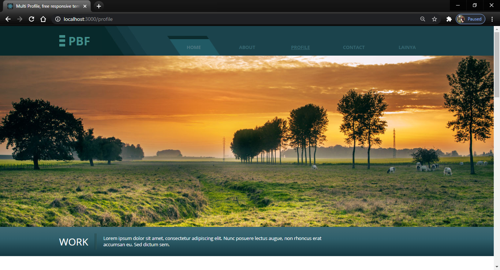

8. Code : pages/Contact.js

            import React, { Component } from 'react';
            import { Link } from 'react-router-dom';
            class Contact extends React.Component {

                state = {
                    latitude : true,
                    longtitude : null
                };
                async componentDidMount (){
                    const url ="https://api.wheretheiss.at/v1/satellites/25544";
                    const response = await fetch(url);
                    const data = await response.json();
                    this.setState({
                        latitude : false
                        });
                }
                render() {
                    return (
                        

                            

                            

                            

                                

                                    

                                        

                                            

                                                <h2 class="welcome-title text-uppercase">In Touch</h2>
                                                
                                                
Lorem ipsum dolor sit amet, consectetur adipiscing elit. Nunc posuere lectus augue, non rhoncus erat accumsan eu. Sed dictum sem.

                                            

                                        

                                    

                                

                            

                            <section class="templatemo-container">
                                

                                    

                                        

                                            <h2 class="section-title">Contact</h2>
                                            

                                            

                                            
Proin Gravidani

                                        

                                    

                                    

                                        

                                            <h3 class="section-title-2 text-uppercase font-weight-300"><b>Our</b> Information</h3>
                                            
Proin gravida arcu malesuada, venenatis nisl vitae, egestas sem. Vestibulum mauris magna, aliquam non commodo ac, porttitor a augue.

                                            

                                                <i class="fa fa-map-marker fa-3x contact-point-icon blue-text"></i>
                                                

                                                    <b class="text-uppercase contact-point-title blue-text font-weight-700">Address</b>
                                                    
No. 1234, Rama IX Road, Bangkok 12345, Thailand.

                                                

                                            

                                            

                                                <i class="fa fa-envelope-o fa-3x contact-point-icon blue-text"></i>
                                                

                                                    <b class="text-uppercase contact-point-title blue-text font-weight-700">Email</b>
                                                    
mail@company.com

                                                

                                            

                                            

                                                <i class="fa fa-phone fa-3x contact-point-icon blue-text"></i>
                                                

                                                    <b class="text-uppercase contact-point-title blue-text font-weight-700">Phone</b>
                                                    
+(123) 456 7890

                                                

                                            

                                            {this.state.latitude || this.state.longtitude  || !this.state.longtitude ? (
                                                                                

                                                                                {/* <i class="fa fa-phone fa-3x contact-point-icon blue-text"></i> */}
                                                                                

                                                                                    <b class="text-uppercase contact-point-title blue-text font-weight-700">Data Google Maps</b>
                                                                                     
                                                                                     
                                                                                     
                                                                                     
                                                                                    <Link to="/api"><button class="text-uppercase contact-point-title blue-text font-weight-700"> Edit Data </button></Link>
                                                                                    
                                                                                    {/* 
longtitude
 */}
                                                                                

                                                                            

                                                    ) : (
                                                        

                                                            
 {this.state.longtitude.velocity} 

                                                            
 {this.state.longtitude.longitude}

                                                            
 {this.state.longtitude.id}

                                                        

                                                    )}
                                        

                                        

                                            <h3 class="section-title-2 text-uppercase font-weight-300"><b>Leave</b> a message</h3>
                                            <form action="#" method="post" class="tm-contact-form">
                                                

                                                    

                                                        <input type="text" id="contact_name" class="form-control" placeholder="NAME" />
                                                    

                                                    

                                                        <input type="email" id="contact_email" class="form-control" placeholder="EMAIL" />
                                                    

                                                    

                                                        <input type="text" id="contact_subject" class="form-control" placeholder="SUBJECT" />
                                                    

                                                    

                                                        <textarea id="contact_message" class="form-control" rows="8" placeholder="MESSAGE"></textarea>
                                                    

                                                    

                                                        <button type="submit" name="submit" class="text-uppercase btn-blue-gradient btn-submit">send message</button>
                                                    

                                                

                                            </form>
                                        

                                    

                                    

                                        

                                            

                                                

                                            

                                        

                                    

                                

                            </section>
                            

                                

                                

                                

                            

                            
                            

                        

                    );
                }
            }
            export default Contact;

9. Code : pages/Lainya.js

            import React, { Component } from 'react';
            import { Link } from 'react-router-dom';
            import AliceCarousel from 'react-alice-carousel';
            import "react-alice-carousel/lib/alice-carousel.css";
            import image1 from '../slider/14.jpg';
            import image2 from '../slider/15.jpg';
            import image3 from '../slider/16.jpg';
            import image4 from '../slider/17.jpg';

            class Lainya extends React.Component {
                render() {
                    return (
                        

                            

                            {/* <!-- end header image -->
                    <!-- Welcome message --> */}
                            

                                

                                    

                                        

                                            

                                                <h2 class="welcome-title text-uppercase">POLINEMA MALANG</h2>
                                                
                                                
Adalah salah satu perguruan teknik negeri yang berkopeten dalam pengembangan ilmu teknologi berbasis teknik

                                            

                                        

                                    

                                

                            

                            {/* <!-- Welcome message -->
                    <!-- main content --> */}
                            <section class="templatemo-container">
                                

                                    

                                        

                                            <h2 class="section-title">Ulasan Tugas</h2>
                                            

                                            

                                            
Nama : Agus Salim Hadjrianto

                                            
Nim  : 1941723007

                                        

                                    

                                    

                                        

                                            

                                                <h3 class="text-uppercase recent-post-title margin-bottom-30">Aenean Sollicitum</h3>
                                                <AliceCarousel autoPlay autoPlayInterval="3000">
                                                    
                                                    
                                                    
                                                    
                                                </AliceCarousel>
                                                
Aenean sollicitudin, lorem quis bibendum auctor, nisi elit consequat ipsum, nec sagittis sem nibh id elit. Duis sed odio sit amet nibh vulputate cursus a sit amet mauris.

                                            

                                        

                                        

                                            

                                                <h3 class="text-uppercase recent-post-title margin-bottom-30">Aenean Sollicitum</h3>
                                                <AliceCarousel autoPlay autoPlayInterval="3000">
                                                    
                                                    
                                                    
                                                    
                                                </AliceCarousel>
                                                
Aenean sollicitudin, lorem quis bibendum auctor, nisi elit consequat ipsum, nec sagittis sem nibh id elit. Duis sed odio sit amet nibh vulputate cursus a sit amet mauris.
                                                <Link to="/search">Lainya</Link>
                                                

                                            

                                        

                                    

                                

                            </section>
                            

                                

                                

                                

                            

                        

                    );

                }
            }

            export default Lainya;

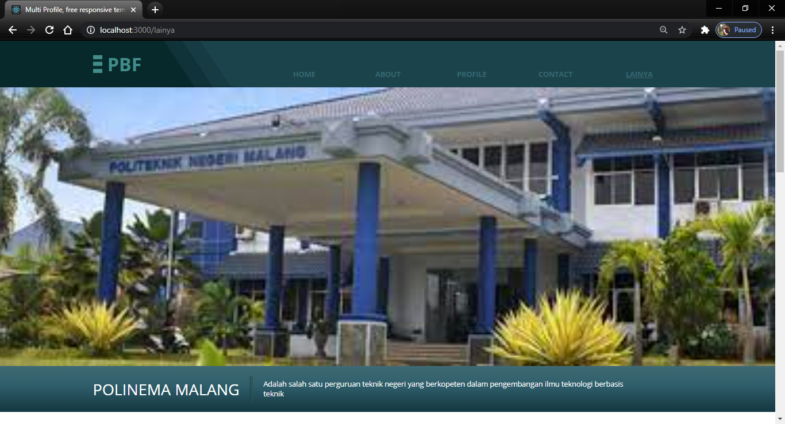

10. Code : pages/Api.js

            import React, { Component } from 'react';
            // import './App.css';
            import ItemDetails from './item-details';
            import NewItem from './new-item';
            import EditItem from './edit-item';
            import ItemService from './mock-item-service';

            class Api extends Component {
                constructor(props) {
                    super(props);
                    this.itemService = new ItemService();
                    this.onSelect = this.onSelect.bind(this);
                    this.onNewItem = this.onNewItem.bind(this);
                    this.onEditItem = this.onEditItem.bind(this);
                    this.onCancel = this.onCancel.bind(this);
                    this.onCancelEdit = this.onCancelEdit.bind(this);
                    this.onCreateItem = this.onCreateItem.bind(this);
                    this.onUpdateItem = this.onUpdateItem.bind(this);
                    this.onDeleteItem = this.onDeleteItem.bind(this);
                    this.state = {
                        showDetails: false,
                        editItem: false,
                        selectedItem: null,
                        newItem: null
                    }
                }
                componentDidMount() {
                    this.getItems();
                }
                render() {
                    const items = this.state.items;
                    if (!items) return null;
                    const showDetails = this.state.showDetails;
                    const selectedItem = this.state.selectedItem;
                    const newItem = this.state.newItem;
                    const editItem = this.state.editItem;
                    const listItems = items.map((item) =>
                        <li key={item.link} onClick={() => this.onSelect(item.link)}>
                            {item.name} |  {item.latitude}
                        </li>
                    );
                    return (
                        

                            

                            

                                

                                    

                                        

                                            

                                                <h2 class="welcome-title text-uppercase">POLINEMA MALANG</h2>
                                                
                                                
Adalah salah satu perguruan teknik negeri yang berkopeten dalam pengembangan ilmu teknologi berbasis teknik

                                            

                                        

                                    

                                

                            

                            <section class="templatemo-container">
                                

                                    

                                        

                                            <h2 class="section-title">REST API</h2>
                                            

                                        

                                    

                                

                                

                                    <ul class="text-uppercase contact-point-title blue-text font-weight-700">
                                        {listItems}
                                    </ul>
                                     
                                    <button class="text-uppercase contact-point-title blue-text font-weight-700" type="button" name="button" onClick={() => this.onNewItem()}>Edit Data</button>
                                     
                                    {newItem && <NewItem onSubmit={this.onCreateItem} onCancel={this.onCancel}></NewItem>}
                                    {showDetails && selectedItem && <ItemDetails item={selectedItem} onEdit={this.onEditItem} onDelete={this.onDeleteItem} ></ItemDetails>}
                                    {editItem && selectedItem && <EditItem onSubmit={this.onUpdateItem} onCancel={this.onCancelEdit} item={selectedItem} ></EditItem>}
                                

                            </section>
                            

                                

                                

                                

                            

                        

                    );
                }

                getItems() {
                    this.itemService.retrieveItems().then(items => {
                        this.setState({ items: items });
                    }
                    );

                }

                onSelect(itemLink) {
                    this.clearState();
                    this.itemService.getItem(itemLink).then(item => {
                        this.setState({
                            showDetails: true,
                            selectedItem: item
                        });
                    }
                    );
                }

                onCancel() {
                    this.clearState();
                }
                onNewItem() {
                    this.clearState();
                    this.setState({
                        newItem: true
                    });
                }
                onEditItem() {
                    this.setState({
                        showDetails: false,
                        editItem: true,
                        newItem: null
                    });
                }

                onCancelEdit() {
                    this.setState({
                        showDetails: true,
                        editItem: false,
                        newItem: null
                    });

                }

                onUpdateItem(item) {
                    this.clearState();
                    this.itemService.updateItem(item).then(item => {
                        this.getItems();
                    }
                    );
                }
                onCreateItem(newItem) {
                    this.clearState();
                    this.itemService.createItem(newItem).then(item => {
                        this.getItems();
                    }
                    );
                }
                onDeleteItem(itemLink) {
                    this.clearState();
                    this.itemService.deleteItem(itemLink).then(res => {
                        this.getItems();
                    }
                    );
                }
                clearState() {
                    this.setState({
                        showDetails: false,
                        selectedItem: null,
                        editItem: false,
                        newItem: null
                    });
                }
            }

            export default Api;

11. Code : pages/item-details.js

            import React, { Component } from 'react';

            // import './App.css';

            class ItemDetails extends Component {

            constructor(props) {

                super(props);

                this.onEdit = this.onEdit.bind(this);

                this.onDelete = this.onDelete.bind(this);

            }

            render() {

                const item = this.props.item;

                return (

                

                
Name:  {item.name}

                
latitude:  {item.latitude}

                
lat:  {item.lat}

                
longtitude:  {item.longtitude}

                
long:  {item.long}

                
Description:  {item.description}

                 

                <button onClick={() => this.onDelete()}>Delete</button> 

                <button onClick={() => this.onEdit()}>Edit</button>

                

                );

            }

            onEdit() {

                this.props.onEdit();

            }

            onDelete() {

                const item = this.props.item;

                if(window.confirm("Are you sure to delete item: " + item.name + " ?")) {

                this.props.onDelete(item.link);

                }

            }

            }

            export default ItemDetails;

12. Code : pages/edit-item.js

            import React, { Component } from 'react';

            // import './App.css';

            import Validator from '../shared/Validator';

            class EditItem extends Component {

            constructor(props) {

                super(props);

                this.validator = new Validator();

                this.onCancel = this.onCancel.bind(this);

                this.onSubmit = this.onSubmit.bind(this);

                this.handleInputChange = this.handleInputChange.bind(this);

                const itemToEdit = props.item;

                this.state = {

                name: itemToEdit.name,

                latitude: itemToEdit.latitude,

                lat: itemToEdit.lat,

                longtitude: itemToEdit.longtitude,

                description: itemToEdit.description,

                link: itemToEdit.link

                };

            }

            handleInputChange(event) {

                const target = event.target;

                const value = target.value;

                const name = target.name;

                this.setState({

                [name]: value

                });

            }

            onCancel() {

                this.props.onCancel();

            }

            onSubmit() {

                if (this.validator.validateInputs(this.state)) {

                this.props.onSubmit(this.state);

                }

            }

            render() {

                return (

                

                Edit item: {this.state.name}

                

                    <label className="field-name">Name: 

                    <input value={this.state.name} name="name" maxLength="" required onChange={this.handleInputChange} placeholder="item name" />

                    </label>

                

                

                    <label className="field-name">latitude: 

                    <input value={this.state.latitude} name="latitude" maxLength="" required onChange={this.handleInputChange} placeholder="latitude" />

                    </label>

                

                

                    <label className="field-name">lat: 

                    <input value={this.state.lat} name="lat" maxLength="" pattern="[-]{,}" onChange={this.handleInputChange} placeholder="lat" />

                    </label>

                

                

                    <label className="field-name">longtitude: 

                    <input value={this.state.longtitude} name="longtitude" maxLength="" pattern="[a-z|A-Z]{}" onChange={this.handleInputChange} placeholder="longtitude" />

                    </label>

                

                

                    <label className="field-name">Description: 

                    <textarea value={this.state.description} name="description" onChange={this.handleInputChange} placeholder="description" />

                    </label>

                

                 

                <button onClick={() => this.onCancel()}>Cancel</button> 

                <button onClick={() => this.onSubmit()}>Update</button>

                

                );

            }

            }

            export default EditItem;

13. Code : pages/new-item.js

            import React, { Component } from 'react';

            // import './App.css';

            import Validator from '../shared/Validator';

            class NewItem extends Component {

            constructor(props) {

                super(props);

                this.validator = new Validator();

                this.onCancel = this.onCancel.bind(this);

                this.onSubmit = this.onSubmit.bind(this);

                this.handleInputChange = this.handleInputChange.bind(this);

                this.state = {

                name: '',

                latitude: '',

                lat: '',

                longtitude: '',

                description: ''

                };

            }

            handleInputChange(event) {

                const target = event.target;

                const value = target.value;

                const name = target.name;

                this.setState({

                [name]: value

                });

            }

            onCancel() {

                this.props.onCancel();

            }

            onSubmit() {

                if(this.validator.validateInputs(this.state)) {

                    this.props.onSubmit(this.state);

                }

            }

            render() {

                return (

                

                New item:

                

                    <label className="field-name">Name: 

                    <input value={this.state.name} name="name" maxLength="" required onChange={this.handleInputChange} placeholder="item name" />

                    </label>

                

                

                    <label className="field-name">latitude: 

                    <input value={this.state.latitude} name="latitude" maxLength="" required onChange={this.handleInputChange} placeholder="latitude" />

                    </label>

                

                

                    <label className="field-name">lat: 

                    <input value={this.state.lat} name="lat" maxLength="" pattern="[-]{,}" onChange={this.handleInputChange} placeholder="lat" />

                    </label>

                

                

                    <label className="field-name">longtitude: 

                    <input value={this.state.longtitude} name="longtitude" maxLength="" pattern="[a-z|A-Z]{}" onChange={this.handleInputChange} placeholder="longtitude code" />

                    </label>

                

                

                    <label className="field-name">Description: 

                    <textarea value={this.state.description} name="description" onChange={this.handleInputChange} placeholder="description" />

                    </label>

                

                 

                <button onClick={() => this.onCancel()}>Cancel</button> 

                <button onClick={() => this.onSubmit()}>Create</button>

                

                );

            }

            }

            export default NewItem;

14. Code : pages/mock-item-service.js

            class ItemService {

                constructor () {

                    this.items = [

                        { link: 1, name: "Google Map 1", latitude: "1", lat: "-7.1502", longtitude: "1", long: "111.8817", description: "Bojonegoro" },
                        { link: 2, name: "Google Map 2", latitude: "2", lat: "-7.1503", longtitude: "2", long: "111.8818", description: "Bojonegoro" },
                        { link: 3, name: "Google Map 3", latitude: "3", lat: "-7.1504", longtitude: "3", long: "111.8819", description: "Bojonegoro" },
                        { link: 4, name: "Google Map 4", latitude: "4", lat: "-7.1505", longtitude: "4", long: "111.88110", description: "Bojonegoro" },
                        { link: 5, name: "Google Map 5", latitude: "5", lat: "-7.1506", longtitude: "5", long: "111.88111", description: "Bojonegoro" }

                    ];

                }

                async retrieveItems() {

                    return Promise.resolve(this.items);

                }

                async getItem(itemLink) {

                    for (var i = 0; i < this.items.length; i++) {

                        if (this.items[i].link === itemLink) {

                            return Promise.resolve(this.items[i]);

                        }

                    }

                    return null;

                }

                async createItem(item) {

                    console.log("ItemService.createItem():");

                    console.log(item);

                    return Promise.resolve(item);

                }

                async deleteItem(itemId) {

                    console.log("ItemService.deleteItem():");

                    console.log("item ID:" + itemId);

                }

                async updateItem(item) {

                    console.log("ItemService.updateItem():");

                    console.log(item);

                }

            }

            export default ItemService;

Code : shared/Validator.js

            class Validator {
                
                
                validateInputs(inputData) {
                
                    let errorMsg = "";
                
                    if(!inputData.name) {
                
                    errorMsg +="Please enter name of this item.\n"
                
                    }
                
                    if(!inputData.summary) {
                
                    errorMsg +="Please enter summary of this item.\n"
                
                    }
                
                    if(inputData.year.toString().match(/[^0-9]/g)) {
                
                    errorMsg +="Year must be a number.\n"
                
                    }
                
                    if(inputData.longtitude.length > 0 && !inputData.longtitude.match(/^[a-z|A-Z][a-z|A-Z]$/)) {
                
                    errorMsg +="longtitude code must be two letters.\n"
                
                    }
                
                    if(errorMsg.length === 0){
                
                    return true;
                
                    } else {
                
                    alert(errorMsg);
                
                    return false;
                
                    }
                
                }
                
                }
                
                
                export default Validator;

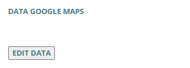

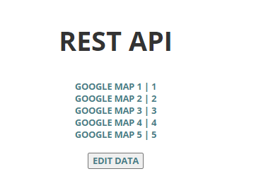,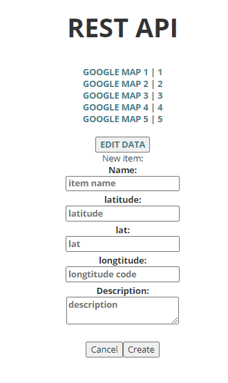,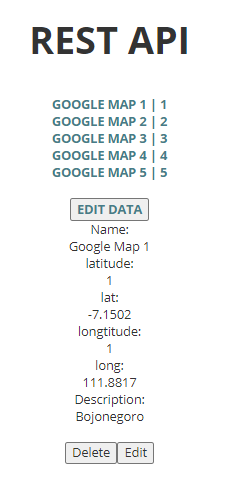

15. Membuat fiture Search 

Create folder search & apps in pages

Code : search/index.js

            import Search from './apps/components/search';

            export default Search;

Code : search/registerServiceWorker.js

            // In production, we register a service worker to serve assets from local cache.

            // This lets the app load faster on subsequent visits in production, and gives
            // it offline capabilities. However, it also means that developers (and users)
            // will only see deployed updates on the "N+1" visit to a page, since previously
            // cached resources are updated in the background.

            // To learn more about the benefits of this model, read https://goo.gl/KwvDNy.
            // This link also includes instructions on opting out of this behavior.

            const isLocalhost = Boolean(
            window.location.hostname === 'localhost' ||
                // [::1] is the IPv6 localhost address.
                window.location.hostname === '[::1]' ||
                // 127.0.0.1/8 is considered localhost for IPv4.
                window.location.hostname.match(
                /^127(?:\.(?:25[0-5]|2[0-4][0-9]|[01]?[0-9][0-9]?)){3}$/
                )
            );

            export default function register() {
            if (process.env.NODE_ENV === 'production' && 'serviceWorker' in navigator) {
                // The URL constructor is available in all browsers that support SW.
                const publicUrl = new URL(process.env.PUBLIC_URL, window.location);
                if (publicUrl.origin !== window.location.origin) {
                // Our service worker won't work if PUBLIC_URL is on a different origin
                // from what our page is served on. This might happen if a CDN is used to
                // serve assets; see https://github.com/facebookincubator/create-react-app/issues/2374
                return;
                }

                window.addEventListener('load', () => {
                const swUrl = `${process.env.PUBLIC_URL}/service-worker.js`;

                if (isLocalhost) {
                    // This is running on localhost. Lets check if a service worker still exists or not.
                    checkValidServiceWorker(swUrl);

                    // Add some additional logging to localhost, pointing developers to the
                    // service worker/PWA documentation.
                    navigator.serviceWorker.ready.then(() => {
                    console.log(
                        'This web app is being served cache-first by a service ' +
                        'worker. To learn more, visit https://goo.gl/SC7cgQ'
                    );
                    });
                } else {
                    // Is not local host. Just register service worker
                    registerValidSW(swUrl);
                }
                });
            }
            }

            function registerValidSW(swUrl) {
            navigator.serviceWorker
                .register(swUrl)
                .then(registration => {
                registration.onupdatefound = () => {
                    const installingWorker = registration.installing;
                    installingWorker.onstatechange = () => {
                    if (installingWorker.state === 'installed') {
                        if (navigator.serviceWorker.controller) {
                        // At this point, the old content will have been purged and
                        // the fresh content will have been added to the cache.
                        // It's the perfect time to display a "New content is
                        // available; please refresh." message in your web app.
                        console.log('New content is available; please refresh.');
                        } else {
                        // At this point, everything has been precached.
                        // It's the perfect time to display a
                        // "Content is cached for offline use." message.
                        console.log('Content is cached for offline use.');
                        }
                    }
                    };
                };
                })
                .catch(error => {
                console.error('Error during service worker registration:', error);
                });
            }

            function checkValidServiceWorker(swUrl) {
            // Check if the service worker can be found. If it can't reload the page.
            fetch(swUrl)
                .then(response => {
                // Ensure service worker exists, and that we really are getting a JS file.
                if (
                    response.status === 404 ||
                    response.headers.get('content-type').indexOf('javascript') === -1
                ) {
                    // No service worker found. Probably a different app. Reload the page.
                    navigator.serviceWorker.ready.then(registration => {
                    registration.unregister().then(() => {
                        window.location.reload();
                    });
                    });
                } else {
                    // Service worker found. Proceed as normal.
                    registerValidSW(swUrl);
                }
                })
                .catch(() => {
                console.log(
                    'No internet connection found. App is running in offline mode.'
                );
                });
            }

            export function unregister() {
            if ('serviceWorker' in navigator) {
                navigator.serviceWorker.ready.then(registration => {
                registration.unregister();
                });
            }
            }

Code : apps/index.js

            import AppContainer from './containers/AppContainer';

            export default AppContainer;

Code : components/renderFoeld.js

            import React from 'react';
            import { FormGroup, Label, Input } from 'reactstrap';

            const renderField = ({
            input,
            label,
            type,
            meta: { touched, error, warning },
            }) => (
            <FormGroup>
                <Label>{label}</Label>
                <Input {...input} placeholder={label} type={type} />
                {touched &&
                ((error && {error}) ||
                    (warning && {warning}))}
            </FormGroup>
            );

            export default renderField;

Code : components/search.js

            import React, { Component } from 'react';
            import { Container, Row, Col, Card, CardImg } from 'reactstrap';

            import SearchForm from './SearchForm';
            import './App.css';

            class Apps extends Component {
            constructor(props) {
                super(props);

                this.fetchImage = this.fetchImage.bind(this);
            }

            fetchImage({ keyword }) {
                this.props.fetchImage(keyword);
            }

            render() {
                const { loading, images } = this.props;

                return (
                <Container>
                    <Row>
                    <Col>
                        <h1>Search</h1>
                    </Col>
                    </Row>
                    <Row>
                    <Col>
                        <SearchForm onSubmit={this.fetchImage} />
                    </Col>
                    </Row>
                    { loading && 
loading...
 }
                    { !loading && images && images.length > 0 &&
                    <Row>
                        { images.map((url, index) => {
                        return <Col key={index} xs="12" sm="6" md="4" lg="3">
                            <Card>
                            <CardImg src={url} />
                            </Card>
                        </Col>
                        })}
                    </Row>
                    }
                </Container>
                );
            }
            }

            export default Apps;

Code : components/SearchForm.js

            import React from 'react';
            import { Field, reduxForm } from 'redux-form';
            import { Button } from 'reactstrap';
            import renderField from './renderField';

            const validate = (values) => {
            const errors = {};
            if (!values.keyword) {
                errors.keyword = 'Required';
            }
            return errors;
            };

            const SearchForm = ({ handleSubmit, pristine, submitting }) => {
            return (
                <form onSubmit={(e) => {
                e.preventDefault();
                handleSubmit();
                }}>
                <Field
                    name="keyword"
                    component={renderField}
                    type="text"
                    label="Keyword"
                    placeholder="Enter a keyword"
                />
                

                    <Button type="submit" disabled={pristine || submitting}>
                    Submit
                    </Button>
                

                </form>
            );
            };

            export default reduxForm({
            form: 'searchForm',
            validate,
            })(SearchForm);

Code : containers/AppCntainers.js

            import { connect } from 'react-redux';
            import Search from '../components/search';

            import { fetchImage } from '../modules/actions';

            export default connect(
            ({ app }) => ({ ...app }),
            (dispatch) => ({
                fetchImage: (keyword) => dispatch(fetchImage(keyword)),
            }),
            )(Search);

Code : modules/action

            import axios from 'axios';
            import {
            SEARCH_REQUEST,
            SEARCH_SUCCESS,
            SEARCH_ERROR,
            } from './index';

            export const searchStart = () => {
            return {
                type: SEARCH_REQUEST,
            };
            };

            export const searchSuccess = (images) => {
            return {
                type: SEARCH_SUCCESS,
                payload: images,
            };
            };

            export const searchError = (errors) => {
            return {
                type: SEARCH_ERROR,
                errors,
            };
            };

            export const fetchImage = (keyword) => {
            return (dispatch) => {
                dispatch(searchStart());
                axios.get(`http://api.giphy.com/v1/gifs/search?q=${keyword}&api_key=dc6zaTOxFJmzC`)
                .then((response) => {
                    const images = response.data.data.map((image) => image.images.original.url);
                    dispatch(searchSuccess(images));
                })
                .catch((error) => {
                    dispatch(searchError(error));
                });
            };
            };

Code : modules/index.js

            export const SEARCH_REQUEST = 'SEARCH_REQUEST';
            export const SEARCH_SUCCESS = 'SEARCH_SUCCESS';
            export const SEARCH_ERROR = 'SEARCH_ERROR';

            const initialState = {
            loading: false,
            images: null,
            errors: null,
            };

            const app = (state = initialState, action) => {
            switch(action.type) {
                case SEARCH_REQUEST:
                return { ...state, loading: true };

                case SEARCH_SUCCESS:
                return { ...state, loading: false, images: action.payload };

                case SEARCH_ERROR:
                return { ...state, loading: false, errors: action.errors };
                default:
                return state;
            }
            };

            export default app;

Code : store/index.js

            import { createStore, applyMiddleware, compose } from 'redux';
            import { routerMiddleware } from 'react-router-redux';
            import thunk from 'redux-thunk';
            import createHistory from 'history/createBrowserHistory';
            import logger from 'redux-logger';

            import rootReducer from './reducer';

            export const history = createHistory();

            const initialState = {};
            const enhancers = [];
            const middleware = [thunk, routerMiddleware(history), logger];

            if (process.env.NODE_ENV === 'development') {
            const devToolsExtension = window.__REDUX_DEVTOOLS_EXTENSION__;

            if (typeof devToolsExtension === 'function') {
                enhancers.push(devToolsExtension());
            }
            }

            const composedEnhancers = compose(applyMiddleware(...middleware), ...enhancers);

            export default createStore(rootReducer, initialState, composedEnhancers);

Code : store/reducer.js

            import { combineReducers } from 'redux';
            import { routerReducer } from 'react-router-redux';
            import { reducer as formReducer } from 'redux-form'

            import app from '../pages/search/apps/modules';

            export default combineReducers({
            router: routerReducer,
            form: formReducer,
            app,
            });

Membuat slider

npm i react-alice-carousel

Code :

     <AliceCarousel autoPlay autoPlayInterval="3000">
            
            
            
            
      </AliceCarousel>

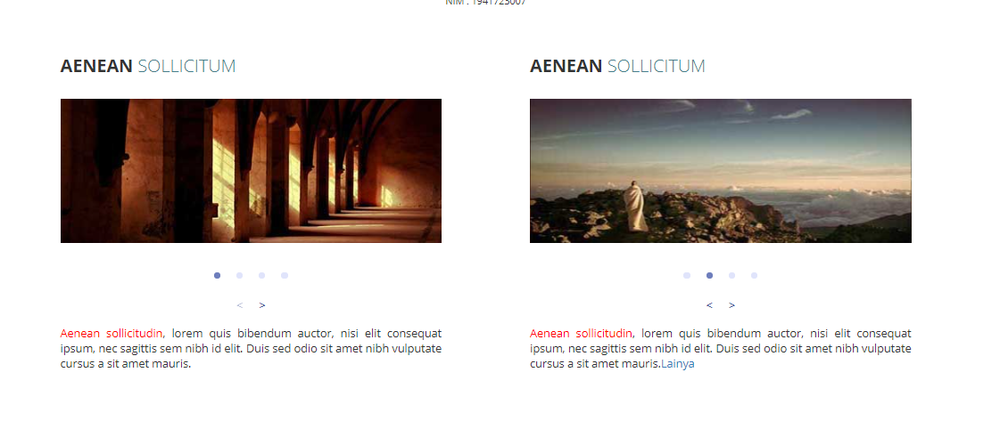

