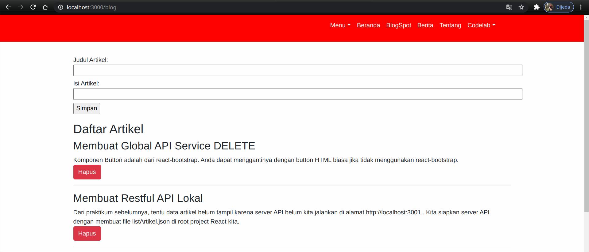
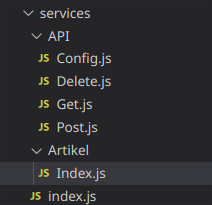
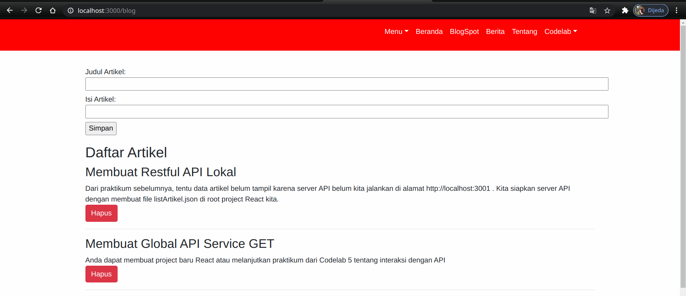
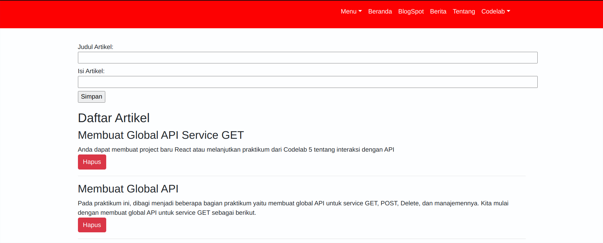
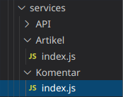
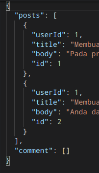
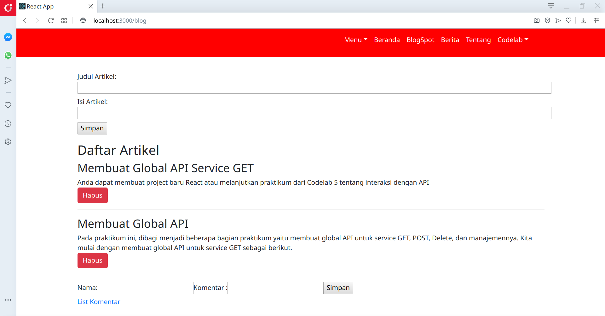
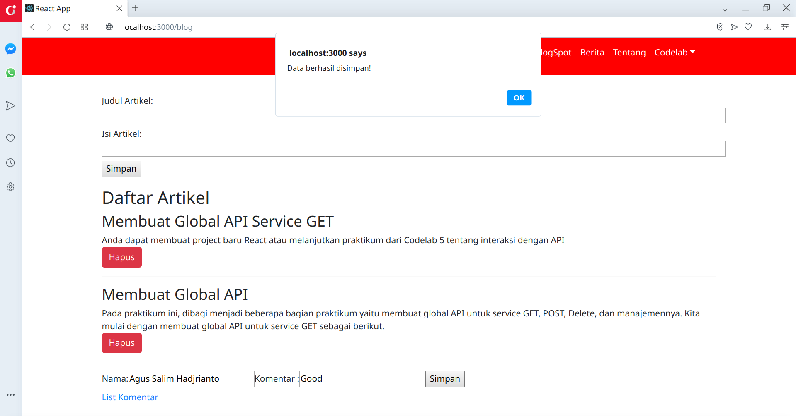
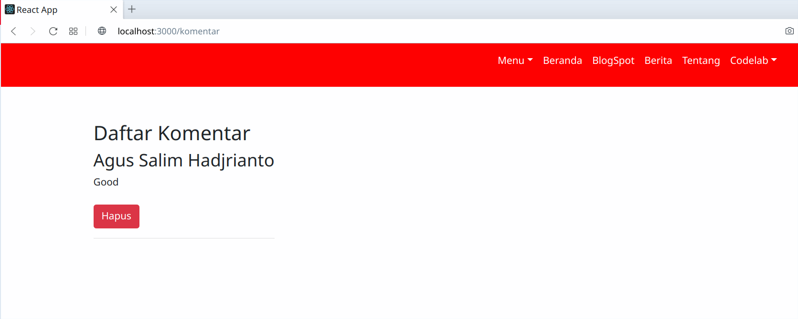

# Global API HOOKS

## Tujuan Pembelajaran

1. Mahasiswa mengetahui dan memahami konsep Global API

## Praktikum 1: Membuat Global API

## Membuat Global API Service GET

### Create Folder Service dan file index.js

### Create BlogPost

### Running 

## Membuat Restful API Lokal

### Membuat file listArtikel.json

### Strat server json

`json-server --watch listArtikel.json --port 3001`

## Solve Error

`install npm -g json-server`

`npx json-server --watch listArtikel.json --port 3001`

`Output`

## Global API Service POST

### Menambah artiker

`Tambah`

`Simpan`

`Hasil`

## Membuat Global API Service DELETE

## Mengelola Global API Service

### Create Folder And File 

### Sebelum di delete

### Sesudah di delete

# TUGAS Praktikum 1

Buatlah folder baru di src/services/Komentar yang digunakan untuk mengelola data komentar. Buatlah komponen baru dengan nama Komentar.js di folder components yang berfungsi untuk mengelola data komentar berdasarkan API yang telah dibuat!

Jangan lupa menambahkan objek di database json "comment" untuk menampung data komentar. Atribut bisa terdiri dari userId, nama, komentar, dan id.

### Struktur

### Json Server

### Output

`Before`

    Tambahkan komentar untuk melihatnya klik list komentar

`After`

