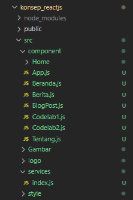
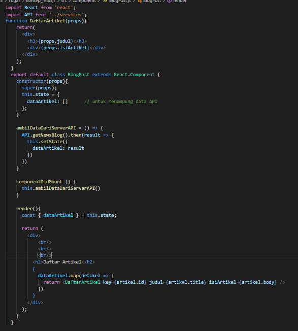
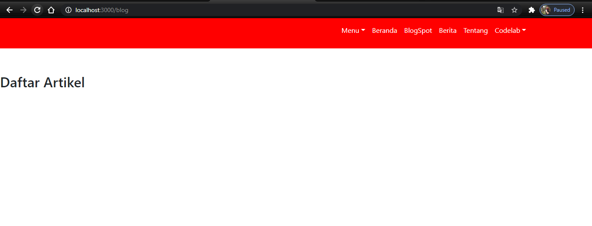
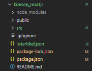
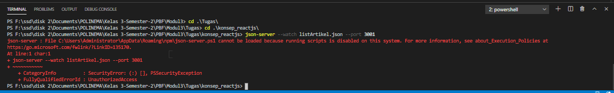
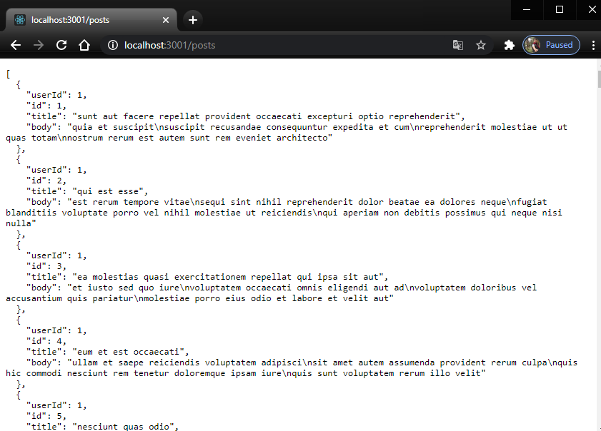
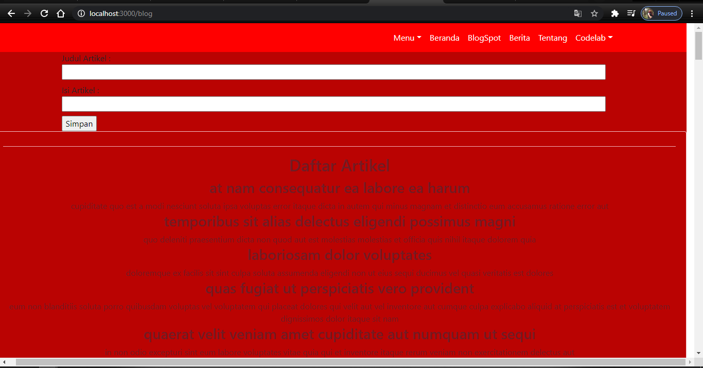
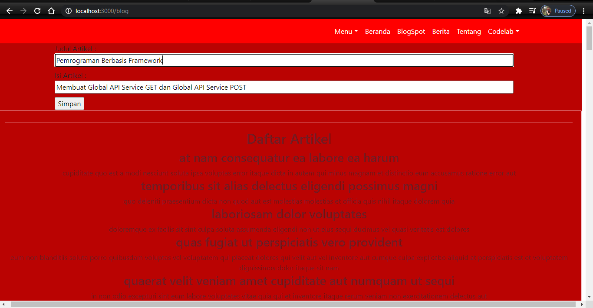
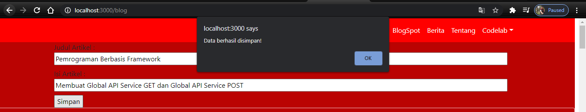
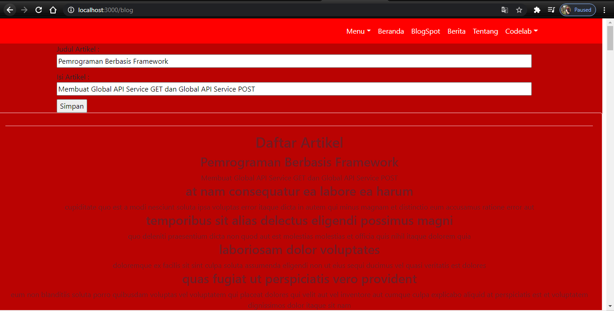

# Praktikum 1: Membuat Global API

## Membuat Global API Service GET

### Create Folder Service dan file index.js

### Create BlogPost

### Running 

## Membuat Restful API Lokal

### Membuat file listArtikel.json

### Strat server json

`json-server --watch listArtikel.json --port 3001`

## Solve Error

`install npm -g json-server`

`npx json-server --watch listArtikel.json --port 3001`

`Output`

## Global API Service POST

### Menambah artiker

`Tambah`

`Simpan`

`Hasil`

