# 10 Firebase ReactJS

## Tujuan Pembelajaran

1. Mahasiswa mengetahui dan memahami konsep firebase
2. Mahasiswa dapat membuat firebase sendiri

### Firebase

Apa itu Firebase ?
Firebase adalah produk dari Google yang menyediakan fasilitas untuk berbagai platform mulai dari autentikasi, penyimpanan, machine learning, dan lain sebagainya.
Pada codelab kali ini, kita akan belajar untuk mengintegrasikan aplikasi React dengan firebase. Kita akan membuat fitur Register dan Login menggunakan fasilitas yang disediakan oleh firebase.
Silakan lanjutkan ke langkah berikutnya untuk memulai praktikum pada codelab ini.

## Praktikum 1: Membuat Form Register

`Struktur`

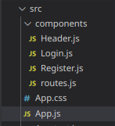

### Output Register

`Register`
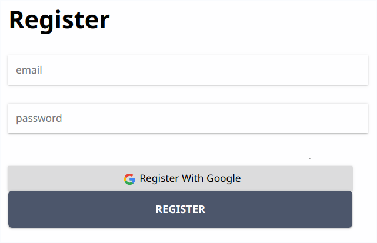

## Praktikum 2: Membuat Form Login

### Output Login

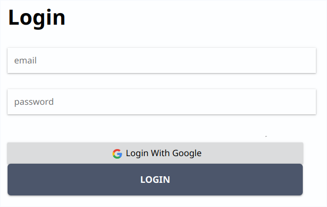

## Praktikum 3: Membuat Koneksi ke Firebase

### Install Firebase

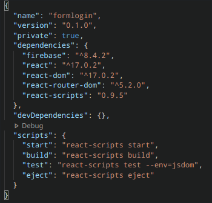

### Login dan buat account di firebase

`Step 1 Create Project & Continue`

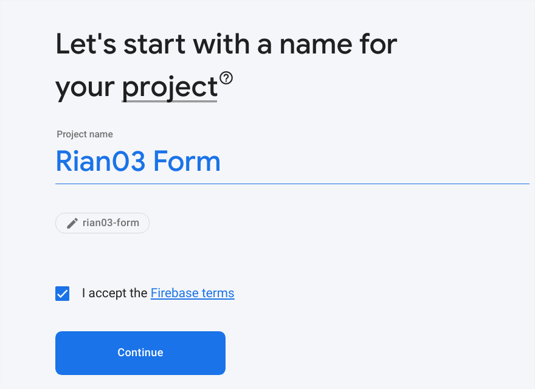

`Step 2 Memilih google analitytic & Continue`

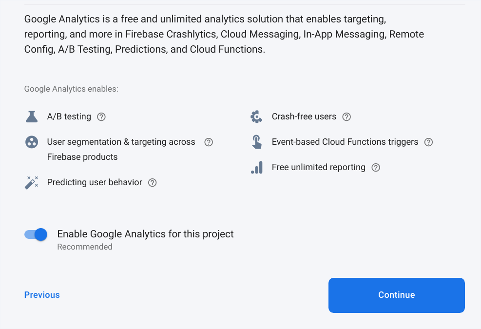

`Step 3 Memilih lokasi $ Continue`

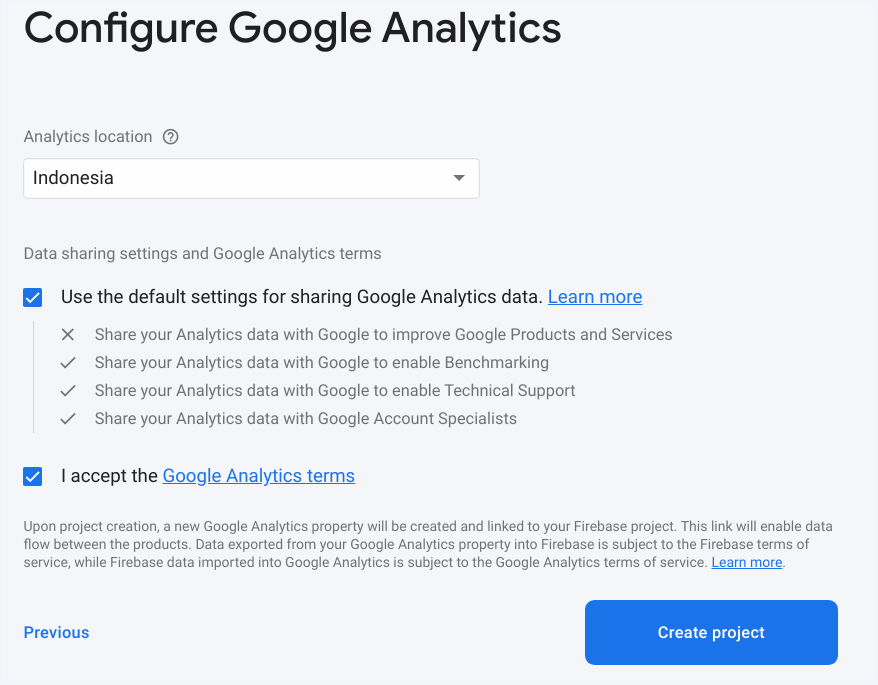

`Finish`

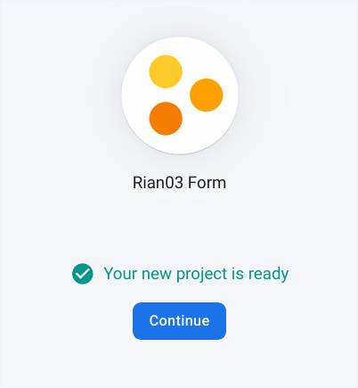

`Register`

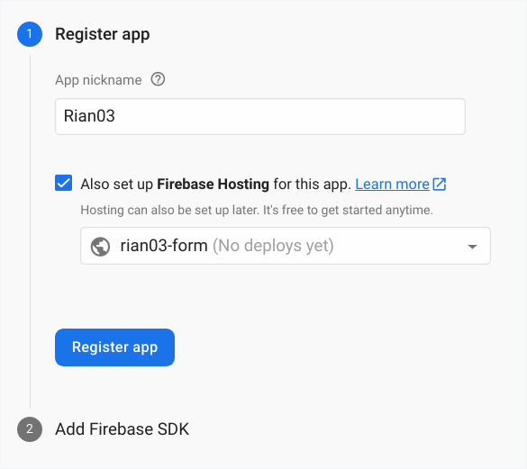

`Masuk ke setting untuk melihat confiq`

`Masuk ke auth untuk melihat email`

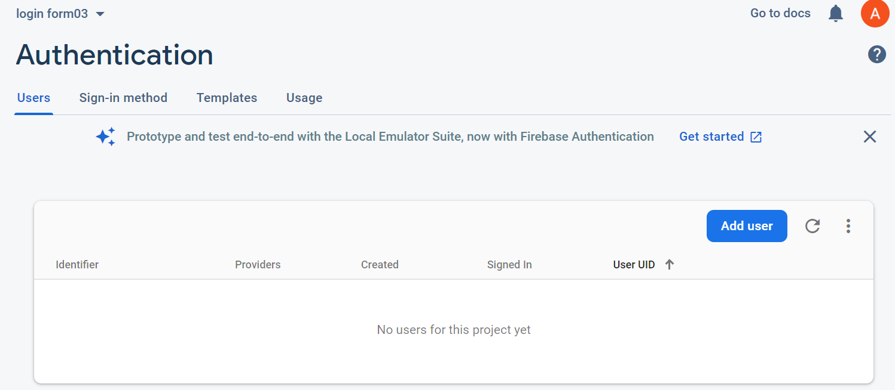

### Output

`False`

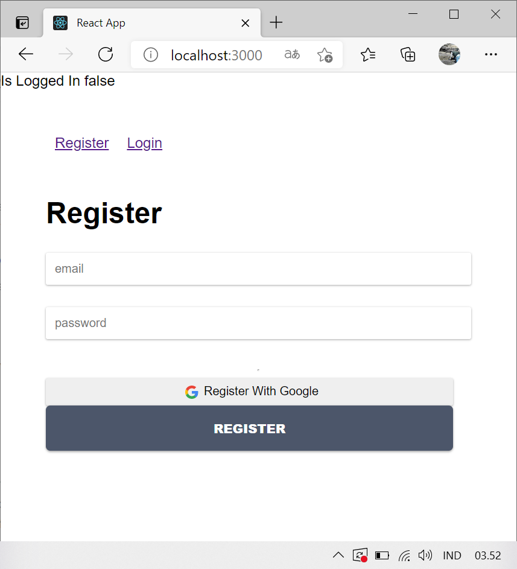

`True`

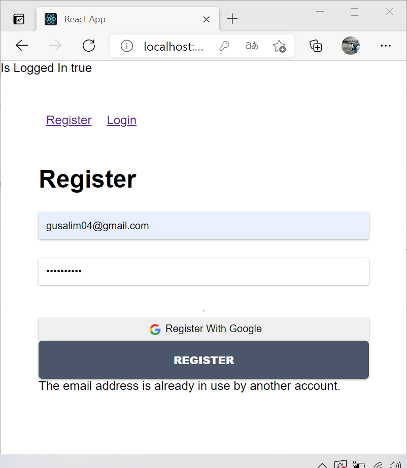

`Firebase`

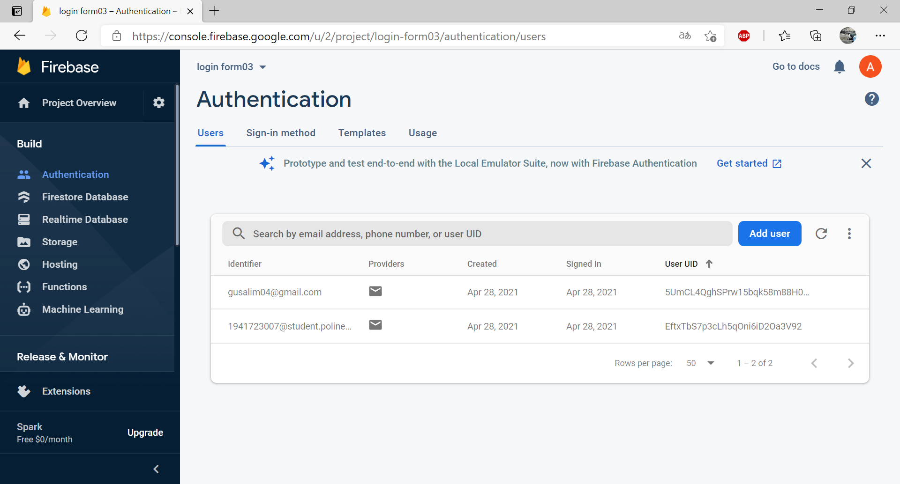

## Tugas Praktikum

1. Dari praktikum sebelumnya, tambahkan aksi pada tombol "Login with Google" dan "Logout" agar bisa melakukan login dan logout dengan akun Google yang sudah kita miliki.

`Login`

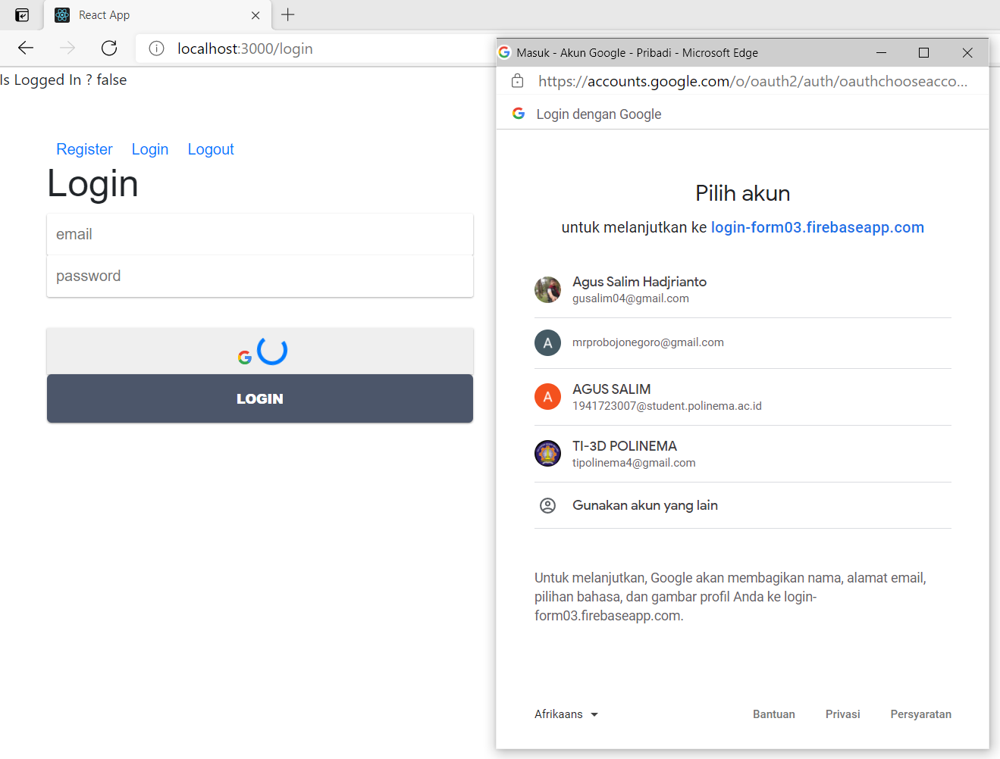

pilih gmail dan jika berhasil maka status akan true

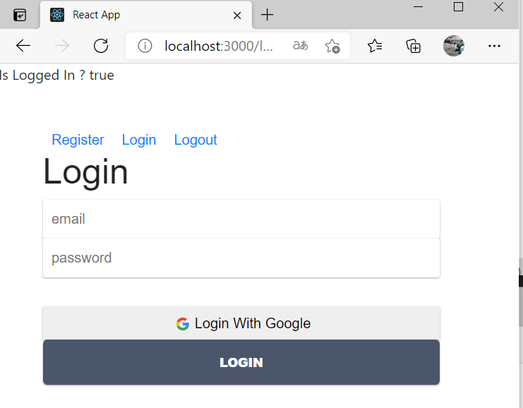

`LogOut`

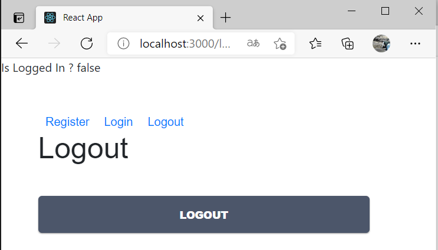

2. Tambahkan animasi loading saat melakukan registrasi dan login. Boleh menggunakan dari tema boostrap atau lainnya.

`Animasi Login`

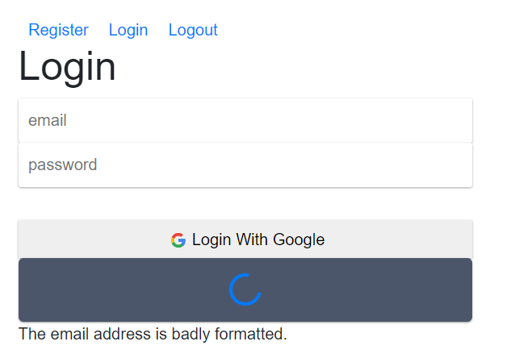

`Animasi Registrasi`

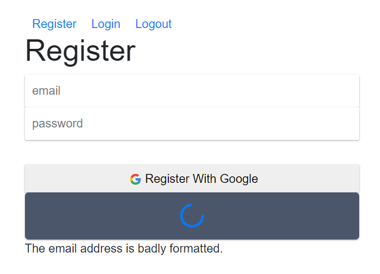