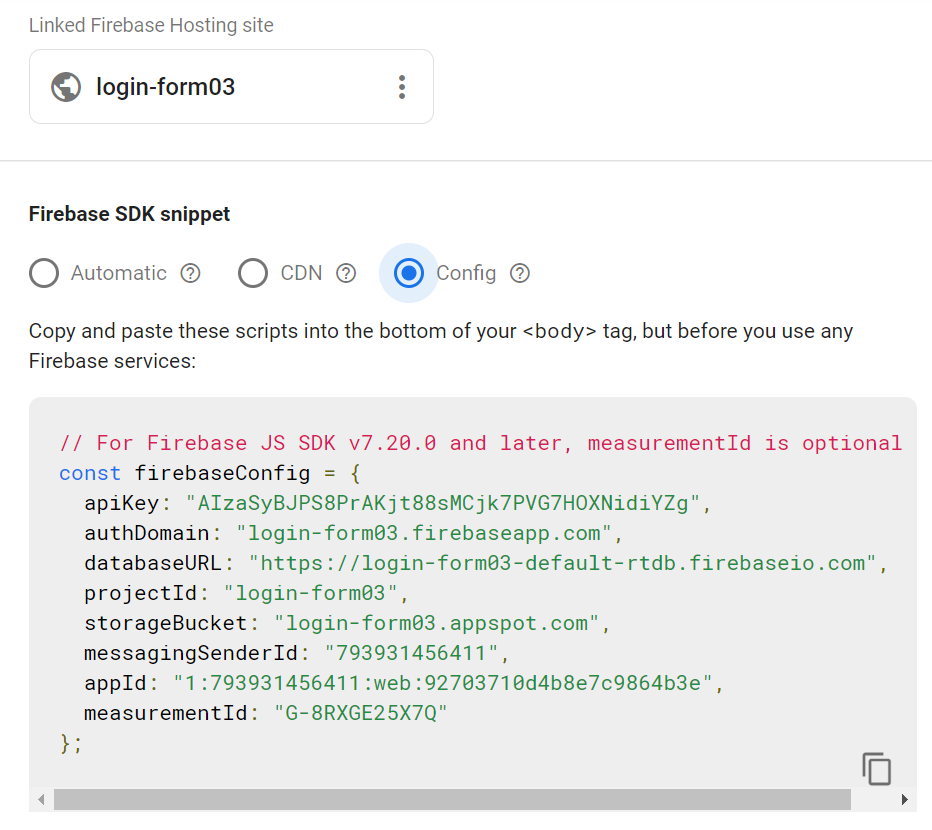
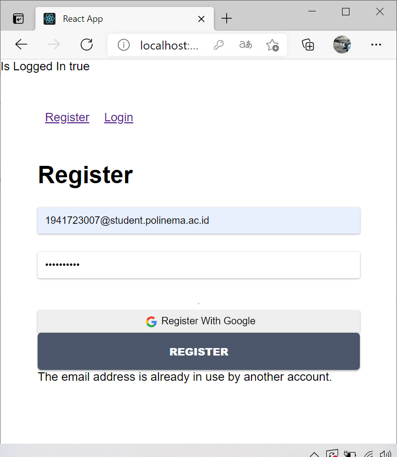

# 10 Firebase ReactJS

### Firebase

Apa itu Firebase ?
Firebase adalah produk dari Google yang menyediakan fasilitas untuk berbagai platform mulai dari autentikasi, penyimpanan, machine learning, dan lain sebagainya.
Pada codelab kali ini, kita akan belajar untuk mengintegrasikan aplikasi React dengan firebase. Kita akan membuat fitur Register dan Login menggunakan fasilitas yang disediakan oleh firebase.
Silakan lanjutkan ke langkah berikutnya untuk memulai praktikum pada codelab ini.

## Praktikum 1: Membuat Form Register

`Struktur`

### Output Register

`Register`

### Output Login

### Install Firebase

### Login dan buat account di firebase

`Step 1 Create Project & Continue`

`Step 2 Memilih google analitytic & Continue`

`Step 3 Memilih lokasi $ Continue`

`Finish`

`Register`

`Masuk ke setting untuk melihat confiq`

`Masuk ke auth untuk melihat email`

### Output

`False`

`True`

`Firebase`

