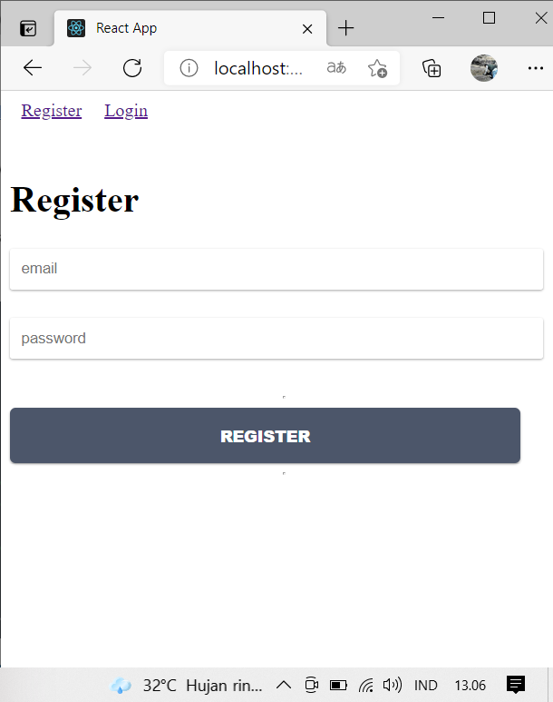
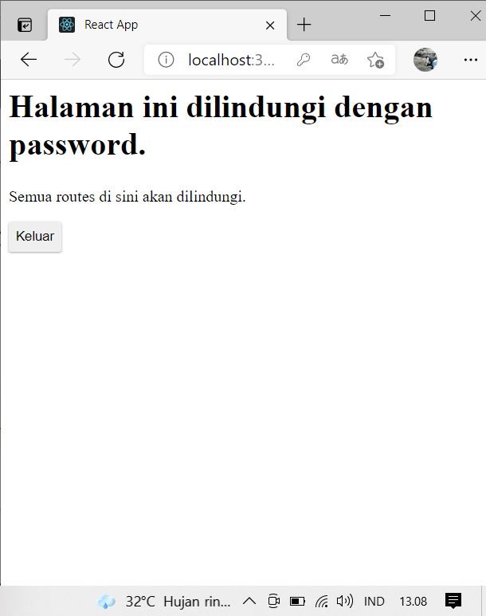
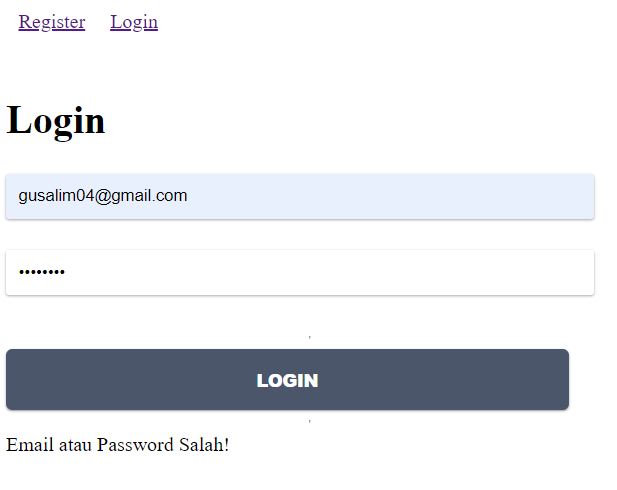
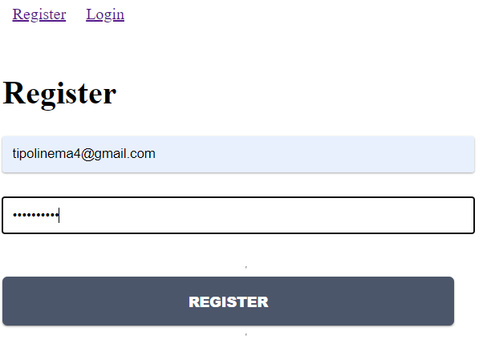
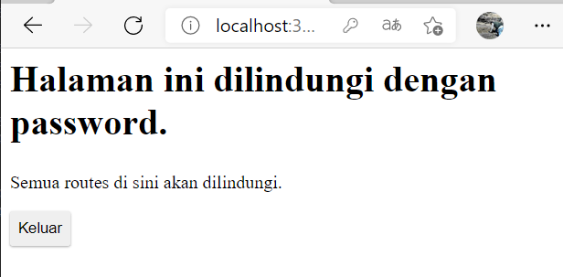

# Redux Thunk

### Membuat Login dengan Firebase dan Redux Thunk

`Register`

`Sesudah Login`

## Tugas Praktikum

1. Berdasarkan praktikum yang telah Anda lakukan, jelaskan perbedaan fitur yang ada dalam komponen Login dan Home! Mengapa komponen Login tidak menggunakan class seperti pada komponen Home ?

`Jawab : `
Karena Pada Home hanya menampilkan data perbedaanya di fungsi pada App.js fungsi menuju ke auth untuk proses, jika data valid baru akan di arahkan ke Home

2. Jelaskan kegunaan dan alur logika dari protectedRoute.js !

Untuk proteksi data Route , Jadi kitika server dinyalakan maka akan di arahkan ke menu Login

3. Coba lakukan login dengan email atau password yang salah, apa yang terjadi? Jelaskan!

`Salah`

Karena data tidak terverifikasi dan tidk ada di state

4. Jika Anda berada di halaman Home, coba akses form login tanpa melakukan logout. Apakah form login bisa diakses? Jelaskan!

`Jawab :`
Tidak bisa karena pada home setelah connect diharuskan logout dulu baru bisa akses ke form login dan register

5. Tambahkan menu Register pada form login sehingga user yang belum terdaftar dapat melakukan registrasi! Jika registrasi sukses, maka user langsung diarahkan ke halaman Home.

`Register `

`Home `

