# CRUD di Firebase

## Praktikum 1 Create database dan Setting Rules

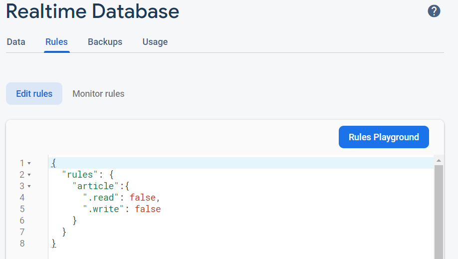

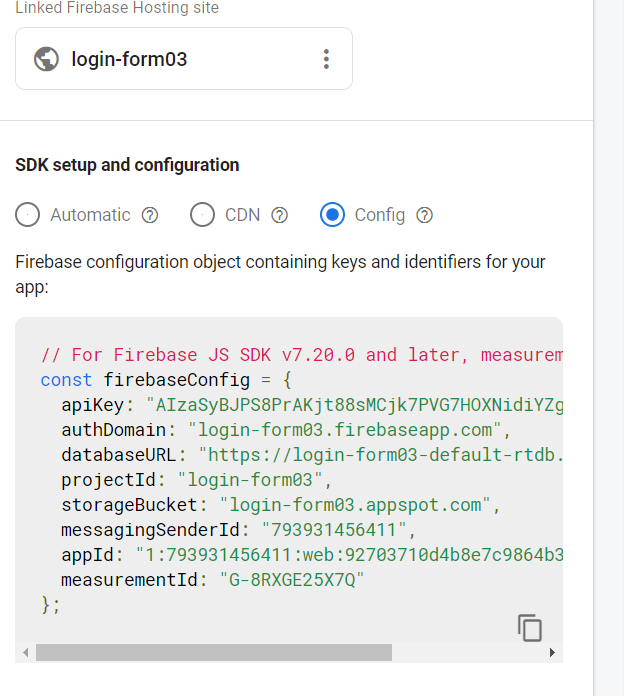

## Praktikum 2: Membuat Fungsi Create Artikel

`Struktur`

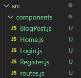

`Tampilan Awal`

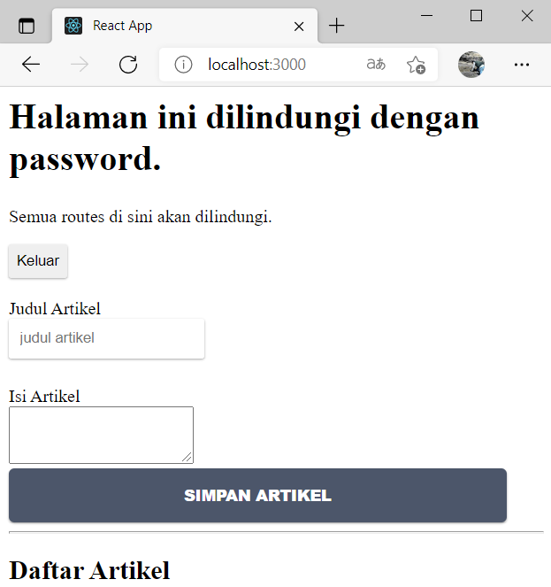

`Sesudah di isi`

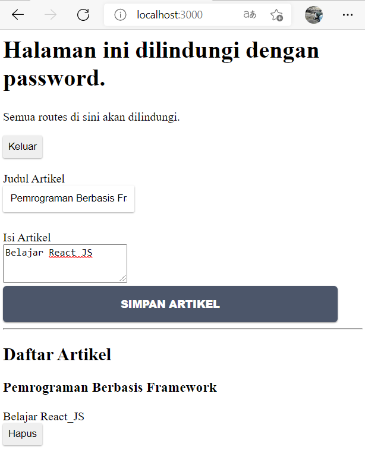

`Data Base`

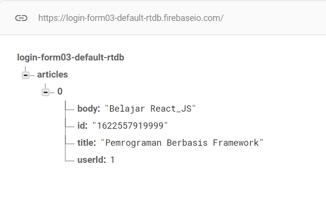

## Praktikum 3: Membuat Fungsi Hapus Artikel

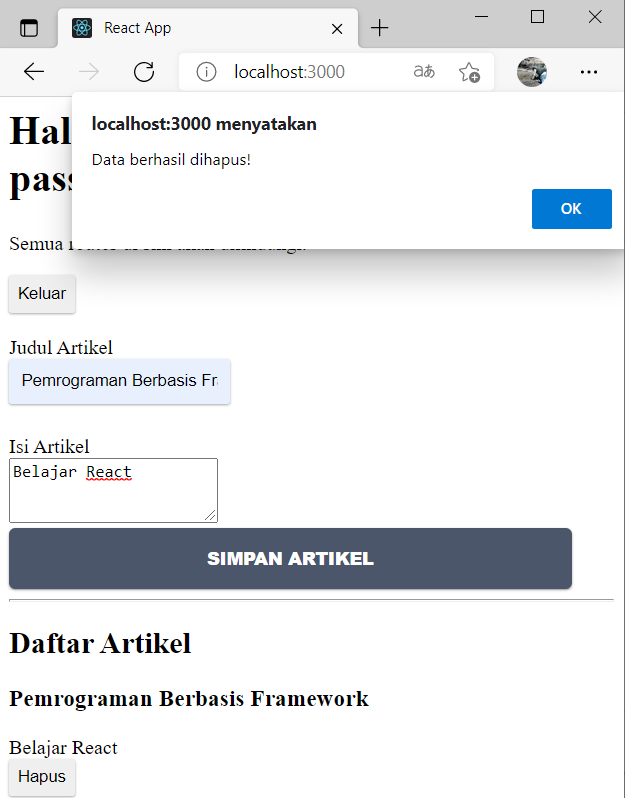

## Praktikum 4: Membuat Fungsi Edit (Update) Artikel

### Fungsi handleTombolEdit

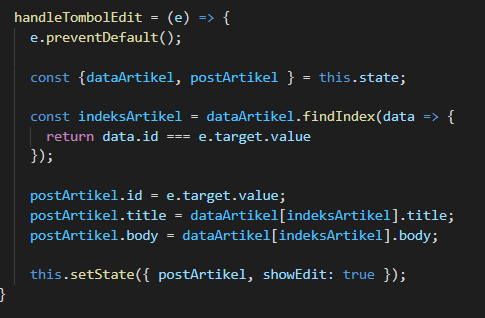

### Tampilan Sebelum di edit

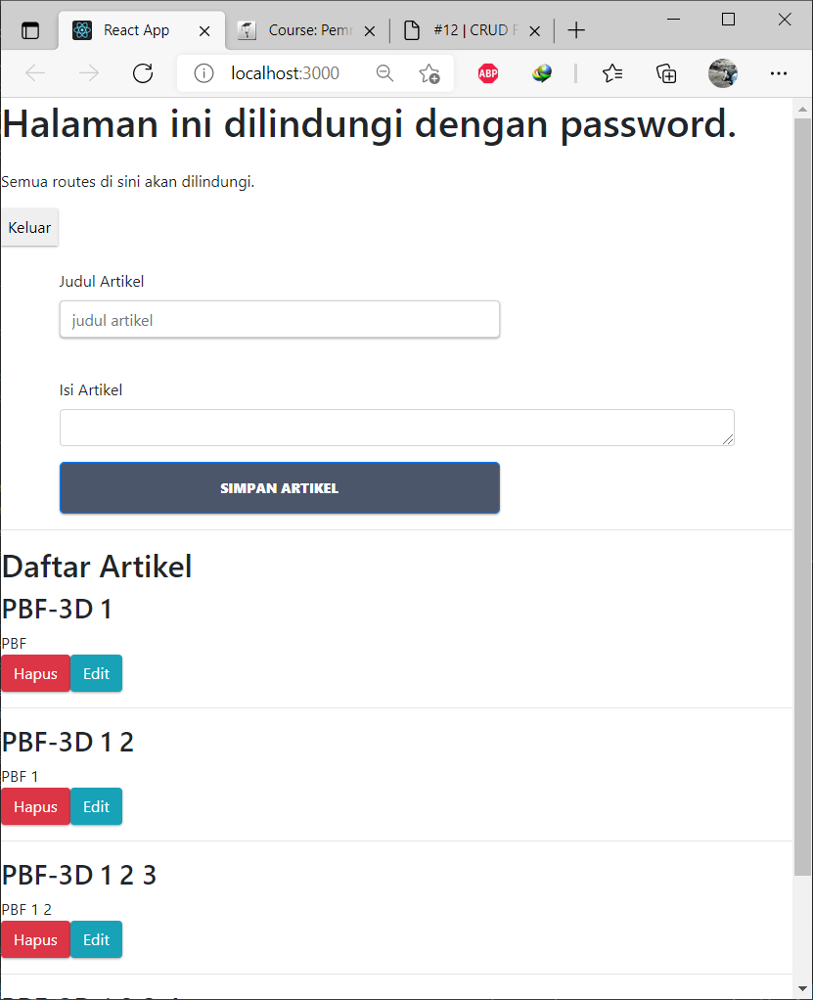

### Tampilan Sesudah di edit

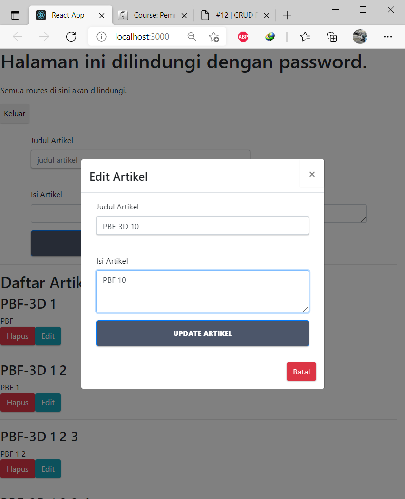

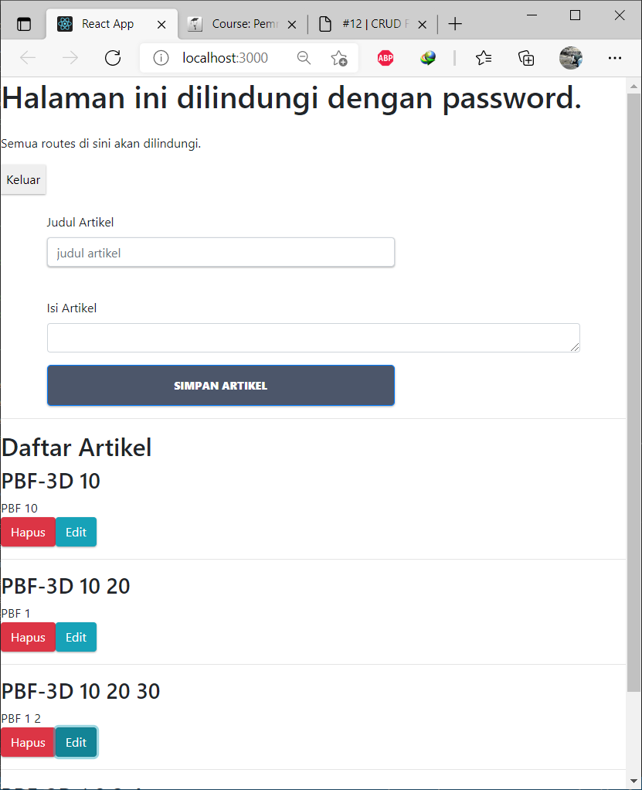

## Tugas Praktikum

1. Berdasarkan praktikum 1 yang telah Anda lakukan, jelaskan perbedaan fungsi locked mode dan test mode pada langkah 3 saat Anda konfigurasi database Firebase?

### Locked Mode

Digunaan untuk membatasi user dan yang dapat mengakses data hanya user yang sudah ter Authentikasi sedangkan pada

### Test Mode 

User tidak dibatasi dan semua yuser yang mempunyai key dpat merubah data secara real time

2. Buatlah variabel userId pada praktikum 2 langkah 4 agar dapat menyimpan email dari user yang sedang login, sehingga dapat tersimpan di database!

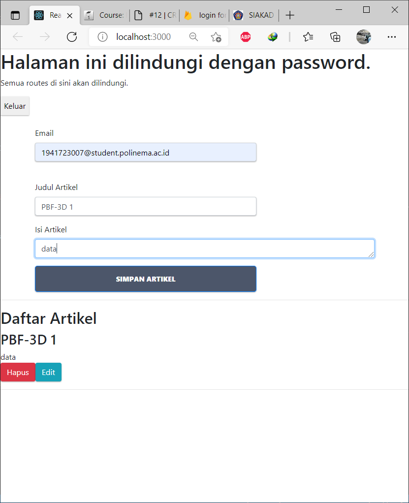

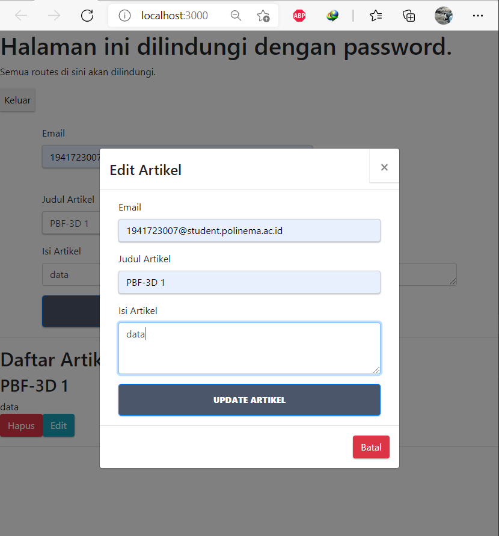

3. Jelaskan maksud kode ini (dataArtikel || []) pada praktikum 2 langkah 6! Mengapa berbeda dari codelabs sebelumnya untuk menampilkan daftar artikel?

Karena pada || [] nilai di kembalikan ke DataArtikel sehingga akan menapilkan seluruh data pada Artikel

4. Lengkapilah kode pada praktikum 4 langkah 5 agar dapat melakukan update artikel! Mengapa setelah klik tombol Update Artikel, form Modal tidak hilang? Bagaimana Anda mengatasi hal tersebut?

Karena masih false

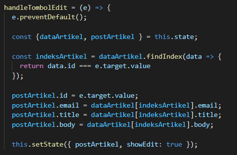

5. Ketika Anda menekan tombol Edit, lalu menekan tombol Batal pada form Modal update artikel. Kemudian coba tambah artikel baru, maka artikel yang tadi kita klik tombol Edit akan berubah jadi data yang artikel baru ditambahkan. Mengapa demikian? Silakan diperbaiki.

Sama dengan gambar di atas setelah ditambahkan postArtikel. maka akan tampil data baru setelah di update