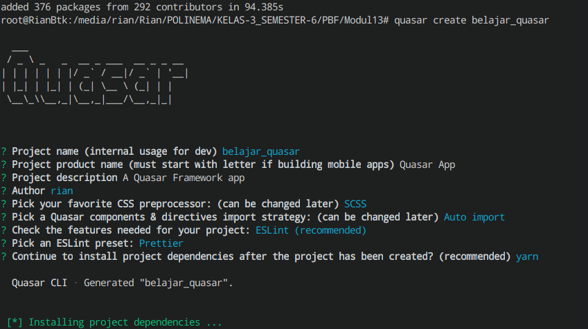
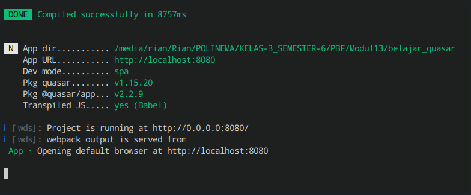
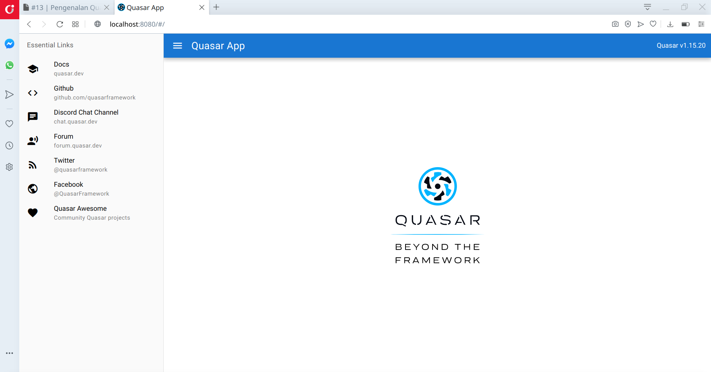
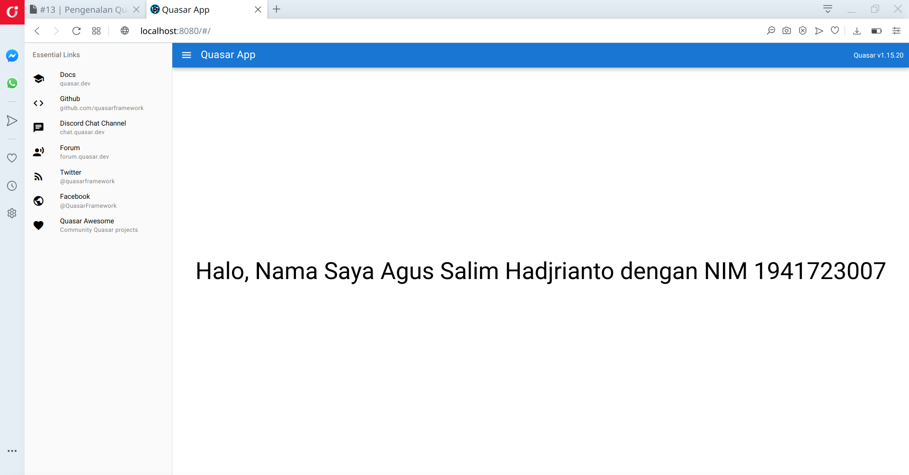

# 13 | Pengenalan Quasar Framework

## Tujuan Pembelajaran

1. Pengenalan dan instalasi Quasar Framework
2. Sekilas tentang Vue.js
3. Hasil survei Quasar 2020

## Praktikum 1: Memulai Quasar Framework

### Instalasi

### Praktikum 2: Membuat Aplikasi Pertama

# Tugas Praktikum

1. Berdasarkan praktikum 1 yang telah Anda lakukan, jelaskan kegunaan file quasar.conf.js ?

Jawab : Untuk mengkonfigurasi component pada quasar seperti

        1. Quasar components, directives and plugins that you’ll be using in your website/app
        2. Default Quasar Language Pack
        3. Icon libraries that you wish to use
        4. Default Quasar Icon Set for Quasar components
        5. Development server port, HTTPS mode, hostname and so on
        6. CSS animations that you wish to use
        7. Boot Files list (that determines order of execution too) – 
           which are files in /src/boot that tell how your app is 
           initialized before mounting the root Vue component
        8. Global CSS/Sass/… files to be included in the bundle
        9. PWA manifest and Workbox options
        10. Electron Packager and/or Electron Builder

2. Jelaskan maksud istilah SPA, SSR, PWA, BEX, Electron app, Cordova, dan Linting code!

Jawab :

1. SPA :Single Page Application (SPA) adalah salah satu jenis aplikasi website dimana hanya ada 1 halaman yang meng-handle semua aktivitas yang terjadi dalam aplikasi tersebut. User tidak akan berpindah halaman browser ketika melakukan request seperti mengisi formulir, klik link, atau aksi lain yang membutuhkan data dari server.

Refrensi : https://www.devaradise.com/id/2018/06/mengenal-apa-itu-single-page-application.html

2. SSR : SSR adalah singkatan dari Server Side Rendering. Ini adalah teknik yang digunakan untuk meningkatkan waktu pemuatan halaman yang dirasakan.
Dalam skenario non-SSR, aplikasi reaksi disajikan sebagai banyak file statis. Langkah-langkah berikut (kurang lebih) dilakukan sebelum pengguna dapat melihat render pertama aplikasi

Refrensi : https://www.konsepkoding.com/2020/07/pengertian-spa-ssg-ssr-jamstack-web.html

3. PWA : PWA adalah singkatan dari Progressive Web App, sebuah aplikasi yang dibangun dengan melakukan optimasi pada sebuah website. 
Optimasi yang dilakukan tidak hanya akan membuat website menjadi lebih cepat namun juga mampu memberikan pengalaman layaknya menggunakan aplikasi mobile. Selain itu, Anda juga tidak perlu membuat aplikasi mobile secara terpisah.

Refrensi : https://www.niagahoster.co.id/blog/progressive-web-app/

4. BEX : Mengizinkan Aplikasi Quasar untuk berkomunikasi dengan berbagai bagian BEX sangat penting. Quasar menutup celah ini menggunakan bridge.

        Ada 4 area dalam BEX yang membutuhkan lapisan komunikasi:

        Aplikasi Quasar itu sendiri - ini berlaku untuk semua jenis BEX yaitu Popup, Halaman Opsi, Alat Dev atau Halaman Web
        Skrip Latar Belakang
        Skrip Konten
        Halaman web tempat BEX dijalankan
Refrensi : https://quasar.dev/quasar-cli/developing-browser-extensions/bex-communication

5. Electron App : kerangka kerja sumber terbuka yang dibuat oleh Cheng Zhao, dan sekarang dikembangkan oleh GitHub. Ini memungkinkan pengembangan aplikasi GUI desktop menggunakan komponen front dan back end yang awalnya dikembangkan untuk aplikasi web: runtime Node.js untuk backend dan Chromium untuk frontend. Electron adalah kerangka kerja GUI utama di balik beberapa proyek sumber terbuka terkenal termasuk Atom GitHub dan editor kode sumber Visual Studio Code Microsoft, aplikasi desktop layanan streaming musik Tidal dan Light Table IDE, di samping klien desktop freeware untuk layanan obrolan Discord .

Refrensi : https://quasar.dev/quasar-cli/developing-electron-apps/introduction

6. Cordova : Kerangka kerja pengembangan aplikasi seluler yang awalnya dibuat oleh Nitobi. Adobe Systems membeli Nitobi pada tahun 2011, mengganti namanya menjadi PhoneGap, dan kemudian merilis versi open source dari perangkat lunak yang disebut Apache Cordova. 

Refrensi: https://quasar.dev/quasar-cli/developing-cordova-apps/introduction

7. Linting : Adalah pemeriksaan otomatis kode sumber Anda untuk kesalahan program dan gaya. Ini dilakukan dengan menggunakan alat lint (atau dikenal sebagai linter). Alat lint adalah penganalisis kode statis dasar. 

Refrensi: https://www.perforce.com/blog/qac/what-lint-code-and-why-linting-important#what-is

3. Jelaskan maksud dan perbedaan ES6, ECMAScript 6, dan ECMAScript 2015 !

Jawab : ES6 adalah sebuah singkatan dari ECMAScript versi 6. ES6 release pada tahun 2015, jadi ES6 sama ES 2015 sama aja ya. Lalu apa itu ECMAScript? ECMAScript adalah sebuah standarisasi scripting language (Javascript) yang dibuat oleh European Computer Manufacturers Association (ECMA). Bahasa gampangnya ECMAScript itu standarnya, Javascript itu implementasinya.

Refrensi : https://medium.com/@renopp/kenalan-dengan-es6-javascript-introduction-variable-arrow-function-part1-6bd5c148473b