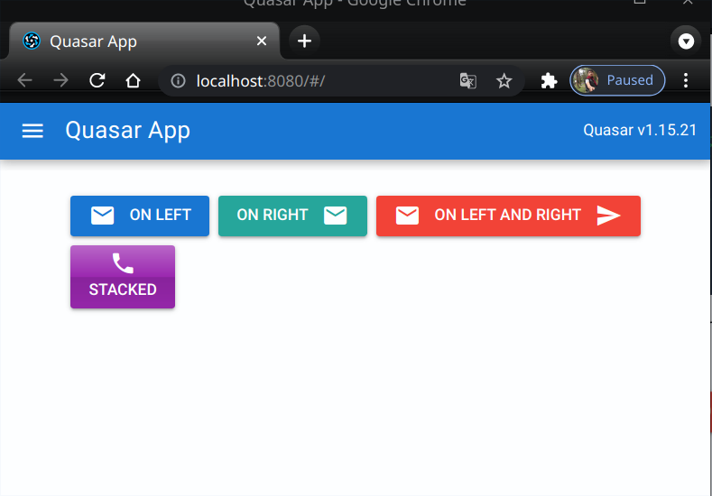

# 14 | Quasar Directives dan Components

## Tujuan Pembelajaran

1. Pengenalan Quasar Directives
2. Pengenalan Quasar Components

### Praktikum 1: Menggunakan Quasar Directives

1. Kita buat project quasar baru atau dapat melanjutkan dari codelabs 13 sebelumnya. Jika ingin membuat project baru, maka lakukan perintah berikut pada CMD atau terminal.

2. Setelah proses pembuatan project baru berhasil, selanjutnya kita definisikan directive Ripple yang akan digunakan pada file quasar.conf.js

3. Setelah itu masuk ke folder src > pages pilih file Index.vue ganti kode template seperti berikut.

4. Selanjutnya kode script seperti berikut.
5. Untuk kode style ganti seperti berikut
6. Kemudian silakan save dan run perintah quasar dev untuk melihat hasilnya di browser. Seharusnya tampil seperti pada gambar berikut. Jika area berwarna kuning di klik/tap, maka akan ada efek Ripple.

## Praktikum 2: Menggunakan Quasar Components

1. Pertama, sebelum kita menggunakan Button dan Icon, perlu kita definisikan komponen yang dibutuhkan pada file quasar.conf.js

2. Selanjutnya kita buat kode HTML di src > pages > Index.vue seperti berikut.
3. Save file quasar.conf.js dan Index.vue tersebut, lalu lihat hasilnya di browser. Seharusnya tampil seperti gambar berikut.

## Tugas Praktikum

1. Berdasarkan praktikum 1 yang telah Anda lakukan, jelaskan maksud kode di template: class="q-pa-md row justify-center" ?
Jawab : Maksud kode di atas yaitu menjelaskan bahwa pada satu template derdapat class yang berada pada div yang berkaitan dengan pertanyaan no 4

2. Berdasarkan praktikum 1 pada langkah nomor 4, jelaskan maksud script tersebut seperti kegunaan konstanta colors, fungsi data(), computed, mounted, dan beforeDestroy() !

    Jawab : 

        1. Color : digunakan untuk mengambil data dari color sehingga button dan txt akan berubah warna

        2. Data () : Berfungsi sebagain parents di mana jika data di panggil maka data kan menampilkan color pada index

        3. Computed : Digunakan untuk menSet bg color

        4. Mounted : Digunakan untuk mengambil data color secara interval

        5. beforeDestroy : Digunakan untuk menSet timer pada interval color sehingga ada efek ketika button di click 

3. Berdasarkan praktikum 2 pada langkah nomor 2, jelaskan maksud tiap kode HTML pada template yang mendefinisikan tiap button tersebut!

    

Semua button berada pada class justify dan gutter dimana mengatur posisi serta bg pada setiap button

* Button On Left berisi label On Left yang berwarna Primary dengan icon mail
* Button On Right berwarna secondary dengan icon-right mail
* Button On Left and Right berwarna red dengan icon mail dan di kanan sent
* Button Stacked berwarna purple dengan label stacked menggunakan icon phone

4. Coba ganti kode template HTML pada praktikum 2 menjadi seperti berikut. Save file, lalu perhatikan apa yang terjadi ? Mengapa terjadi demikian, jelaskan!

Akan terjadi error karena pada satu template tidak bisa menggunakan dua class yang sama namun terpisah bisa menggunakan class kedua ganda namun jika class pertama di duplicate akan terjadi error.

